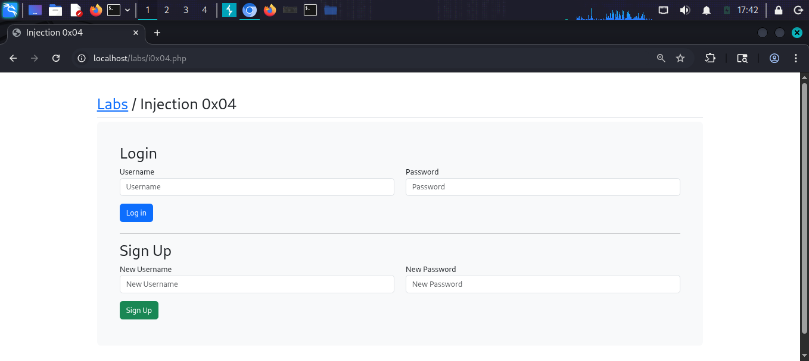
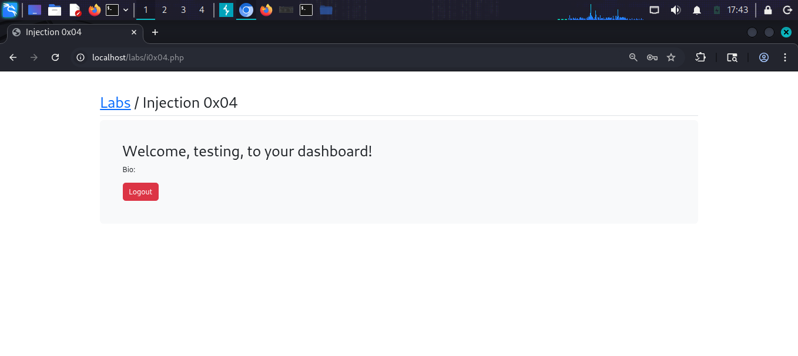
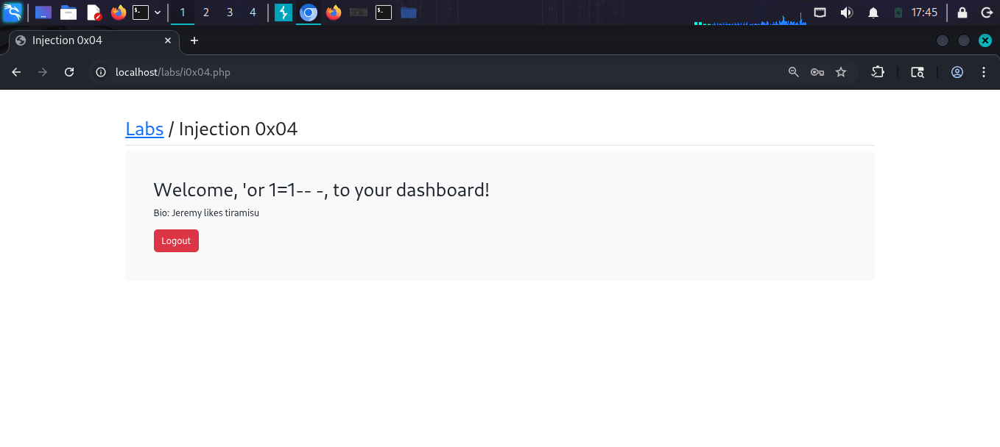

# SQL Injection 0x04

## What is Second Order SQL Injection?
Second Order SQL Injection occurs when malicious
input is stored in the database and later used
in an unsafe SQL query. Unlike regular SQLi,
the attack is not immediate — it triggers later.

## Target
http://localhost/labs/i0x04.php

## Vulnerability
The registration form stores user input directly.
When the stored username is later used in a query,
the injection triggers.

## Attack

### Step 1 — Identify the lab
Login and Sign Up page at i0x04.php

### Step 2 — Register malicious username
Registered a new account with payload as username:
Username: 'or 1=1-- -
Password: anything

### Step 3 — Login with normal account
Logged in as "testing" — got normal dashboard
"Welcome, testing, to your dashboard!"

### Step 4 — Trigger second order injection
Logged in with the malicious username:
'or 1=1-- -
Result: "Welcome, 'or 1=1-- -, to your dashboard!"
Bio: Jeremy likes tiramisu
Successfully accessed Jeremy's account data!

## Payloads Used
```sql
Username registration: 'or 1=1-- -
```

## Screenshots




## Impact
- Authentication bypass via stored payload
- Access to other users private data
- Harder to detect than regular SQL Injection

## Fix
- Sanitize data both on input AND when retrieved
- Use prepared statements everywhere
- Never trust data stored in the database
