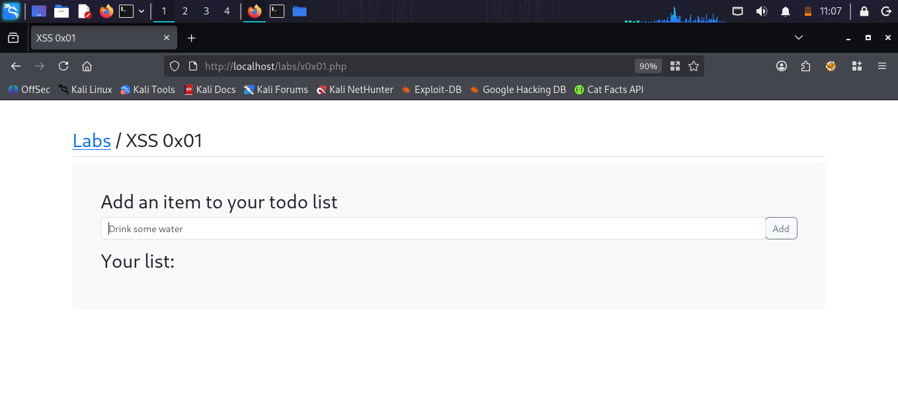
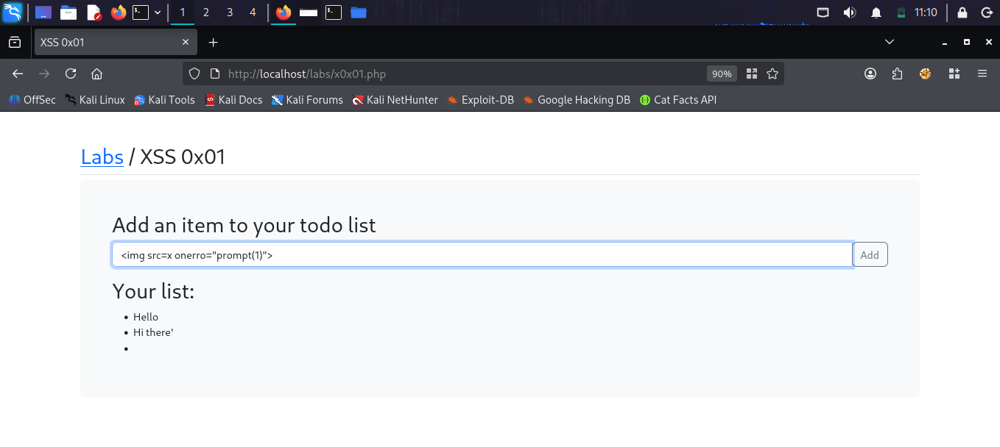
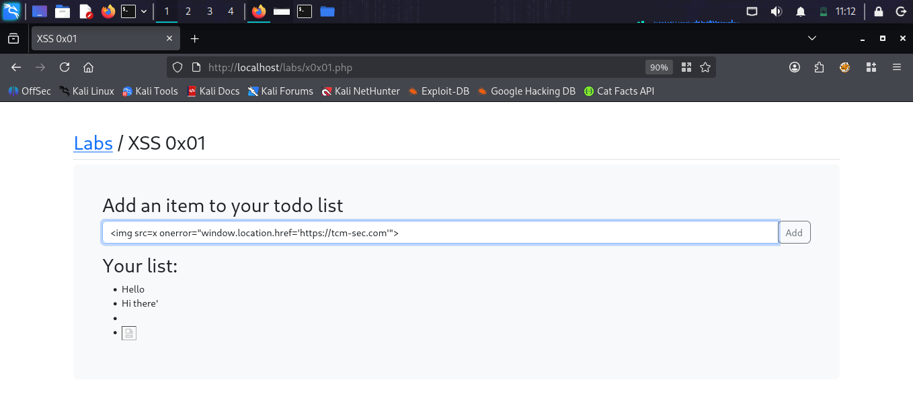
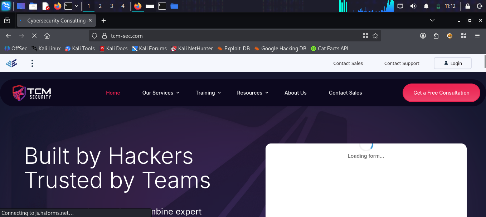

# XSS 0x01

## What is Reflected XSS?
Cross Site Scripting (XSS) is a vulnerability where
an attacker injects malicious JavaScript into a
web page. When other users visit the page, the
script runs in their browser allowing the attacker
to steal cookies, redirect users or perform
actions on their behalf.

## Target
http://localhost/labs/x0x01.php

## Vulnerability
The todo list input field reflects user input
directly into the page without proper sanitization
or encoding.

## Attack

### Step 1 — Identify the lab
Opened the XSS 0x01 lab — a todo list application
where users can add items to a list.

### Step 2 — Test basic XSS payload
Entered payload in the todo input field:

Result: JavaScript executed — prompt appeared!

### Step 3 — Weaponize the XSS
Used a redirect payload to send users to
another website:

Result: Browser automatically redirected to
tcm-sec.com — proof of working XSS!

## Payloads Used
```html


```

## Screenshots





## Impact
- Attacker can steal user cookies and session
- Redirect users to phishing or malicious sites
- Execute any JavaScript in victim's browser
- Perform actions on behalf of the user

## Fix
- Sanitize and encode all user input
- Use Content Security Policy (CSP) headers
- HTML encode output before rendering
- Validate input on both client and server side
