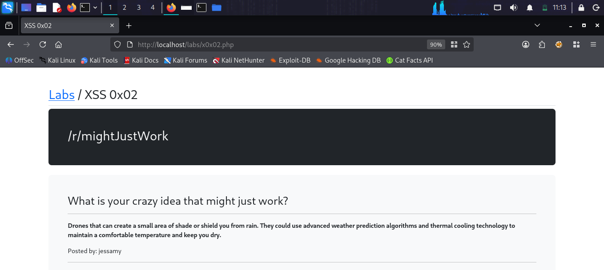
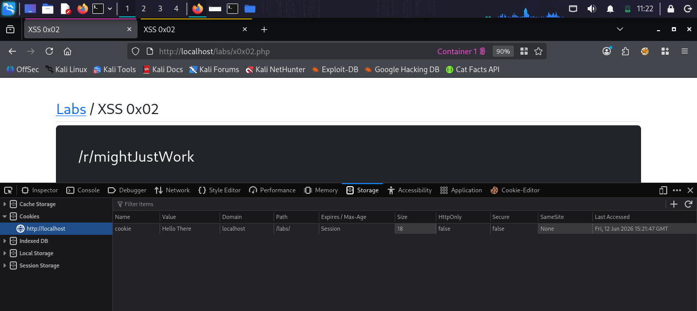
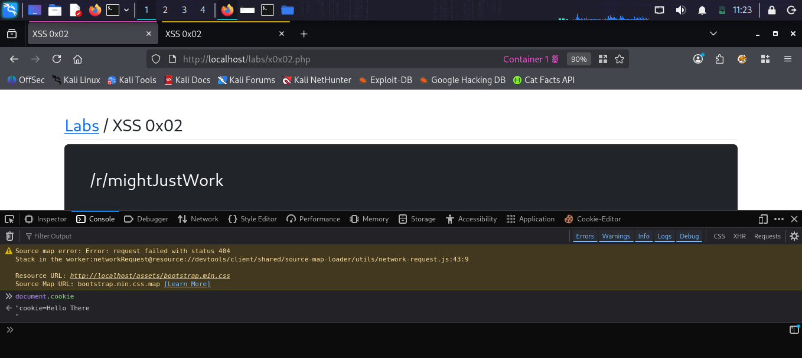
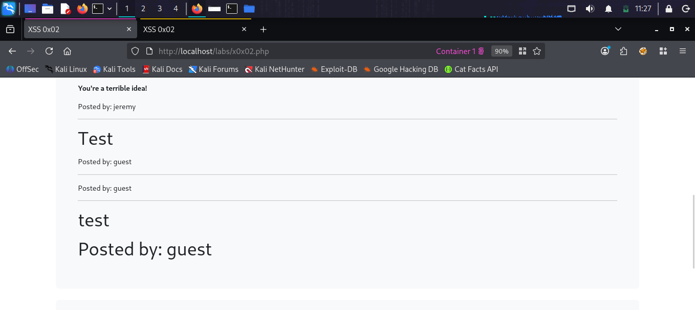
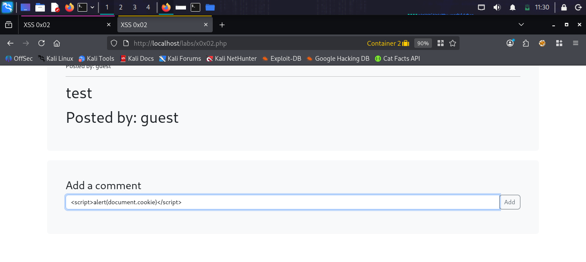
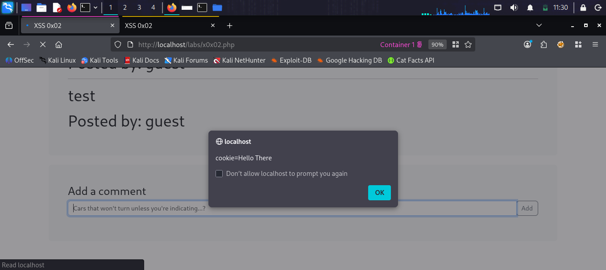

# XSS 0x02

## What is Stored XSS?
Stored XSS is a more dangerous type of XSS where
the malicious script is permanently stored on the
target server (in a database, comment field, etc).
Every user who visits the page automatically runs
the malicious script — no interaction needed.

## Target
http://localhost/labs/x0x02.php

## Vulnerability
The comment section on the /r/mightJustWork page
stores user comments directly in the database
without sanitization. When the page is loaded,
all stored comments are rendered as HTML.

## Attack

### Step 1 — Identify the lab
Opened XSS 0x02 — a Reddit-style page with
posts and comments at /r/mightJustWork.

### Step 2 — Check existing cookies
Opened DevTools → Storage tab
Found a cookie: cookie=Hello There
This is the target we want to steal!

### Step 3 — Verify cookie access in console
Ran in console:
document.cookie
Result: "cookie=Hello There" — accessible via JS!

### Step 4 — Inject stored XSS payload
Added a comment with malicious payload:
<script>alert(document.cookie)</script>
The comment was saved to the database.

### Step 5 — Confirm stored XSS execution
Refreshed the page in a different tab
(simulating another user visiting).
Result: Alert popup appeared showing
"cookie=Hello There" — stored XSS confirmed!

## Payloads Used
```html
<script>alert(document.cookie)</script>
```

## Screenshots







## Impact
- Every visitor automatically runs the payload
- Session hijacking via cookie theft
- Account takeover at scale
- Malware distribution to all users

## Fix
- Sanitize and encode all stored user input
- Use HttpOnly flag on sensitive cookies
- Implement Content Security Policy (CSP)
- Use a library like DOMPurify before rendering
